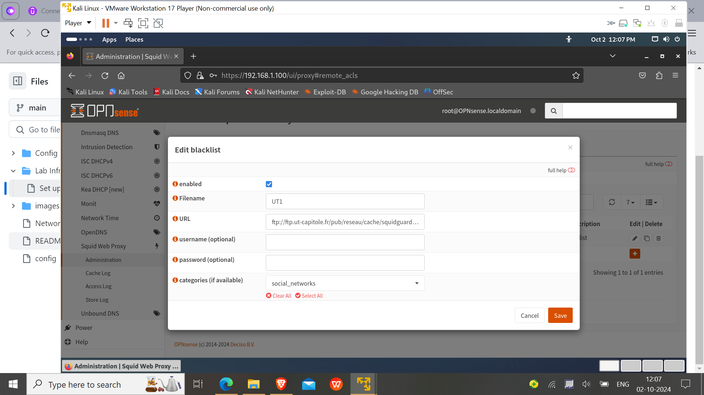

## Overview
- In this section, I am going to describes the setup of the OPNsense firewall in a VMware environment. OPNsense is used for traffic filtering, network segmentation, act as a router and intrusion detection and prevention to secure the internal lab network. 

- Also using tools like suricata(An IDS and IPS), splunk(A SIEM) and os-squid(A web proxy).

---

## Step 1: Download and Install OPNsense

### 1. Download OPNsense ISO
- Visit the [OPNsense download page](https://opnsense.org/download/) and download the ISO image for your platform.

### 2. Create a Virtual Machine for OPNsense 
- **In VMware**:
  - Click **Create a New Virtual Machine** and chose the disc image(ISO) file.
  - Set Name as Opensense and its location to setup the disk image.
    
  - Allocate at least **1GB of RAM** and **1 CPU core**.
  - Create a virtual hard disk of at least **20GB** with multiple partion(It allocate dynamic memory).

- **Network Setup**:
  - Add two network adapters:
    1. **Adapter 1 (WAN)**: Set to **vmnet8** to simulate internet connectivity because vmnet8 is configure for NAT network.
    2. **Adapter 2 (LAN)**: Set to **vmnet3** to connect to your internal VMs.
    

### 3. Install OPNsense
- Start the VM and boot from the OPNsense ISO.
  
- Login as installer with passwd Opnsense
  
- Follow the installation steps:
 
  - Choose **UFS**file system as it compatible to less storage and suitable for our virtual environment.
   
  - Chose the partition the disk.
   
   
  - At Last, set the **root password** for OPNsense.
   
- After installation, the system will reboot, and you’ll see the **console menu** where you can configure the network interfaces.
   
  -Now you can remove the disk image from the booting sequence of opnsense, so that every time it boot from the hard disk only because it make your work and settings persistennt.

---

## Step 2: Basic OPNsense Configuration

### 1. Assign Network Interfaces and ip addresses to the interfaces
- In the console menu, assign the network interfaces by 1 option:
  - **WAN (assigned as em0)**: This will connect to the Internet (vmnet8 interface in vmware).
  - **LAN (assigned as em1)**: This will be your internal network interface for connecting to the VMs(vmnet3 interface of vmware).
   
- Now set up and configure the ip address of both interface by choosing **option 2**:
    -Assigned wan ip, default gateway and the dns server by the dhcp of the host vmware.
    -For LAN(em1) assined a static ip(192.168.1.100) and configure a dhcp server that provide ip address to the vms along with providing the range of ip address assigned by the dhcp server.
  
  
  
  
   -At last restart the services on the opnsense by reboot.

### 2. Access the Web Interface
- From any VM on the **Internal Network** (e.g., Kali Linux), open a browser and go to `https://192.168.1.100`(your Lan interface address).
- Log in with the your credentials:
  - **Username**: `root`
  - **Password**: ********
    
### 3. Initial Setup Wizard
- Follow the OPNsense setup wizard:
  - Set the **Hostname** (set to `opnsense`).
  - Set DNS and Gateway options as default.
    
    
### 4. Update the required packages and download the vmware tools
  -updates the packages and intall the vmware tools as it make running of opnsense smoother in your device.
  

### 5. Configure Multiple LANs or VLANs on the opnsense
-You can configure Multiple LANs on the opsense to create multiple local network within your virtual network

-For this you have to add another LAN interface from your web gui by navigating **Interfaces> Assignment**

-For partion our LAN network into multiple segments you can set up vlan on our LAN interface. For this you have enable vlan
through our opnsense vm and required vlan on it.

  
---

## Step 3: Configuring Firewall Rules and set up IDS/IPS

### 1. Create Basic Firewall Rules for LAN
- Navigate to **Firewall > Rules > LAN**.
- Add a rule to allow all outbound traffic from LAN to WAN:
  - **Action**: Pass
  - **Protocol**: Any
  - **Source**: LAN net
  - **Destination**: Any
    

This rule allows internal VMs to access the internet via the WAN interface.

### 2. Set up port forwarding(if required to forward the particular traffic to a vm or a proxy)

-If you want to forward the traffic to a particular vm or a proxy server incoming at a particular port, You can do this by adding a port forwarding includes traffic from a port forwards to a specific destination.

-Firstly navigate to **firewall >NAT >Port forward** Here is a simple forward to forward the http traffic on port no=80 to a proxy server running at 127.0.0.0:3028

### 3. Set Up Intrusion Detection System (IDS) with Suricata
-**Suricata** is a high performance Network IDS, IPS and Network Security Monitoring engine. It is open source and owned by a community-run non-profit foundation, the Open Information Security Foundation (OISF). Suricata is developed by the OISF.As the opnsense IDS and IPS is based on suricata, so lets configure a basic suricata rule that will generate an alert message whenever there is a newwork scanning(using syn request packet) using nmap in the network. 
 
-
- Navigate to **Services > Intrusion Detection > Adminstration** and enable it along with IPS and Promiscuous mode.
 
- Now i had an cusotmnmap.xml script and cusotmnmap.ruless script(both included in the config). The xml script is used(its work) to download the rule file from my local server running on my kali vm.
- For this first we have to move the xml file to the opnsense /usr/local/onsense/scripts/suricata/metadata/rules directroy using filezilla because till now we have only the cli of opnsense and with this we can't share the file directly. So to transfer file using filezilla we have to setup a sftp connection between the client vm and opnsense.
- **Enable ssh on opnsense** As default the opnsense disable its ssh services
  
- Establise an ssh connection using username and password authentication via filezilla.
- Now copy paste the file to desired location(i.e /usr/local/opnsense/scripts/suricata/metadata/rules/)
  
- Now serve the customnmap.rule file on your local apache server.
- Go to opnsense and restart the services.
- Navigate to **Intrusion Detection > Adminstration > Download**  and download the custom rule from the list and enable it.
  
  
- Now apply rules and start monitoring.
- Now start the nmap scan from the any client machine on the network.
  
- Now Navigate to **Intrusion Detection > Adminstration > Alerts** to see the output of suricata rules.
  
- We can also set the rule to block the packets from nmap scan preventing our network from any type of reconnsiantion attack.
---

## Configuration Files
-
- 

--
### 4.Set up advance firewall configuration like splunk(a SIEM tool) and web proxy(os-squid)
## Splunk 
- **Splunk** is integrated with OPNsense to enable real-time log monitoring, network traffic analysis, and alerting for security-related events. The integration allows for centralized log management and advanced reporting on firewall activity and network performance.
## Why Use Splunk?
- **Log Management**: Splunk aggregates OPNsense logs (firewall, system, and DHCP) for easy analysis and troubleshooting.
- **Monitoring & Alerts**: Custom dashboards and alerts in Splunk provide real-time insights into network activity and security events.
- **Data Visualization**: Visualize OPNsense firewall logs, track traffic trends, and detect anomalies.
- To enable Splunk integration with OPNsense, the following steps were taken:
   - **Option 1**: Install Splunk directly on OPNsense (if hardware resources allow).
   - **Option 2**: Install Splunk on a separate machine or VM and configure OPNsense to forward logs to it using syslog.
- I am not going to configure splunk as it mainly for analysis purpose mainly for blue teaming and it will consume my  hardware resources un-necessarily.

## Web Proxy
- We can also set up a **transparent web proxy** within our opnsense firewall. It mainly used when want to imposed restriction on our network, example want to block access to social media accounts, sexual content via our network. It is mainly used to proctect our network from accessing un-necessay sites and content which may cause harm to our network
-For this the opnsense provide us a squid proxy which is tranparent i.e client browser don't need to configure to the proxy.
-For this we need to install **OS-Squid** plugin on our opnsense from the **Firmware> plugins** of opnsense.
-OPNsense offers a powerful proxy(Squid) that can be used in combination with category based web filtering and any ICAP capable anti virus/malware engine. The proxy can be configured to run in transparent mode, this mean the clients browser does not have to be configured for the web proxy, but all traffic is diverted to the proxy automatically by utilizing Network Address Translation.

  
**Step 1** - Basic Proxy Setup
-After intallation of the pluggin, navigate to **Services >squid web proxy >admistration** and enable the proxy.

**Step 2** - Transparent HTTP
- Go to **Services ‣ Web Proxy ‣ Administration**
-Then select General Forward Settings under the Forward Proxy Tab.
-Select Enable Transparent HTTP proxy(for http traffic) and Click Apply.

**Step 3** - NAT forward Rule
-A simple way to add the NAT forward rule is to click on 'i' of Transpare HTTP proxy and click add new port forward rule for HTTP traffic, defaults should be alright, just press Save and Apply Changes.

-After enabling the port forwarding rules click apply changes.

**Step 4** - CA for Transparent SSL
Before we can setup transparent HTTPS proxy we need to create a Certificate Authority that will authorise that request is from our internal network.
- For this Go to **System ‣ Trust ‣ Authorities** and create a self signed certificate.
- Now download that certificate and Since the CA is not trusted by your browser, you will get a message about this for each page you visit.To solve this you can import the Key into your OS and import it your browser, using your browser setting tabs.

**Step 5** - Transparent SSL
-Go to **Services > Web Proxy > Administration** Then select in General Forward setting and select Transpare HTTP proxy with ssl mode and set your custom CA(certificate authority) as CA authorisation and then apply changes.
-Similary like http forward rule, add a new **forward rule** for HTTPS traffic.

**Step 6** - Configure No SSL Bump
-This step is very important and requires careful consideration! To make sure that known sites are not bumped and keep their original security layer intact, one needs to add those including all subdomain to the SSL no bump sites field. This sites and subdomain that are included in this field, are directly route to the the gateway without being forwarded to our web proxy. Mainly this is for sequiring our confidential data being not read by the proxy like banking deatails etc. This field to include banking site, paypal.com etc which we not want to forward to proxy.

**Step 7** -Remote Access control List
-If you want to control your network access to particular sites and web pages, here you can do this by blacklisting them.
For this I am using a acess control list from **University Toluouse** which contain all website for a particular category/domain like social networking, adult content etc and we can simply choose the category which we want to blacklist.
And we can't access these website through our network.

-To Download the access control list, visit .

**Now apply all the changes and restart the web proxy**

