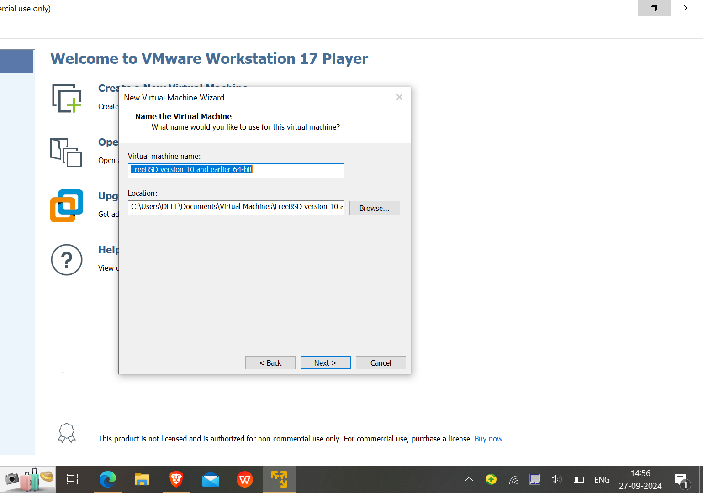
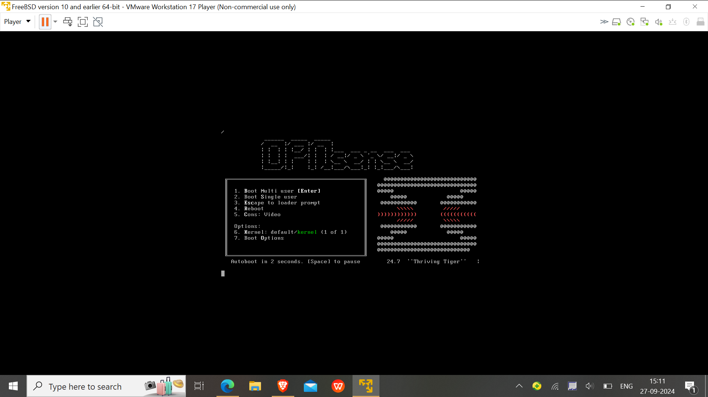
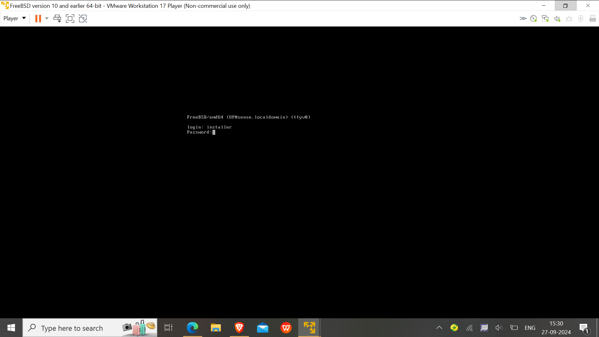
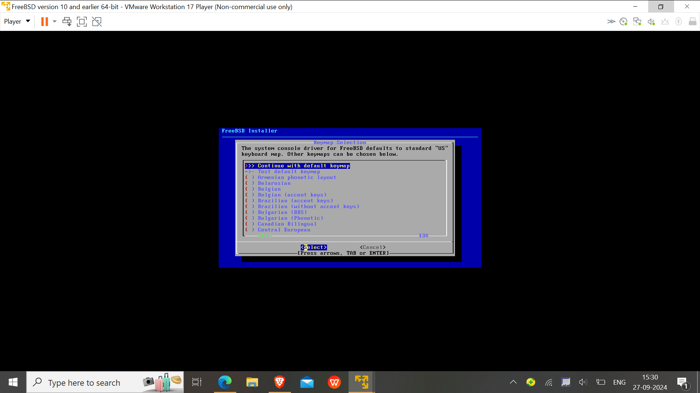
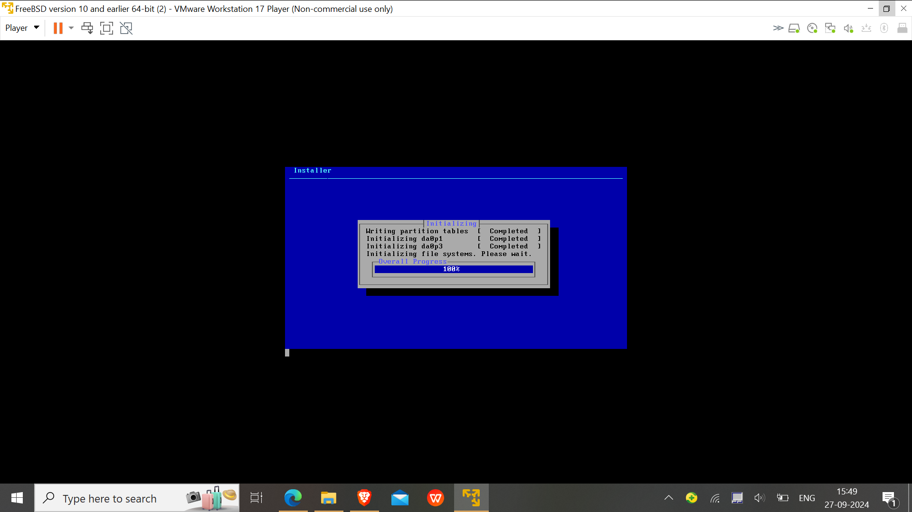
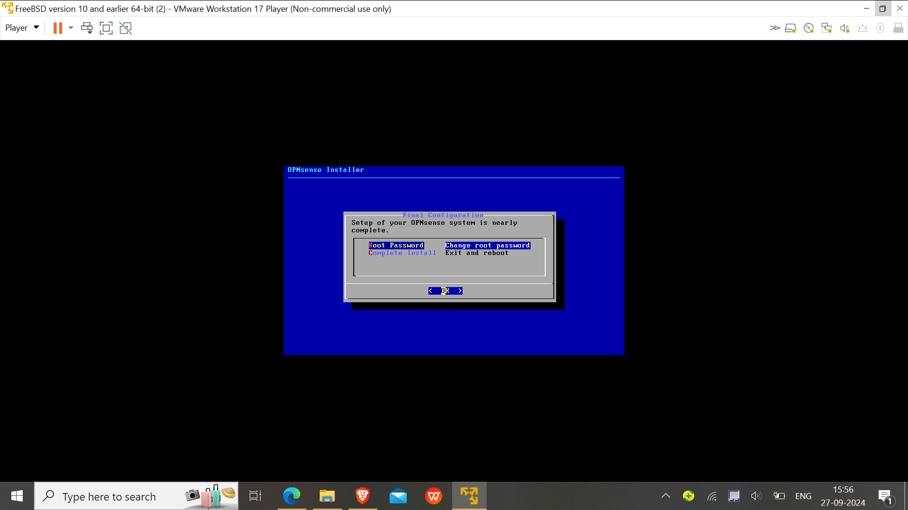
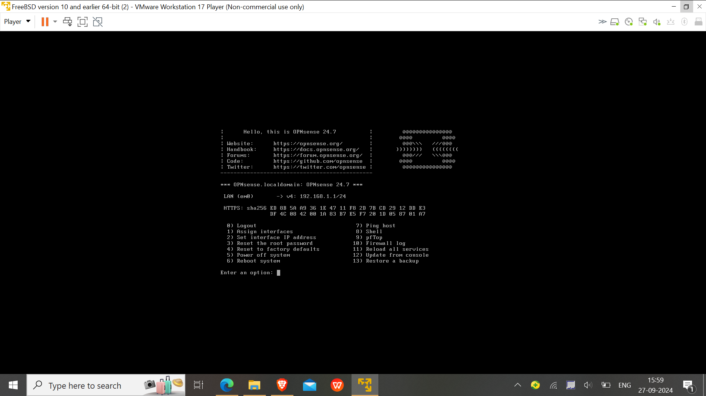
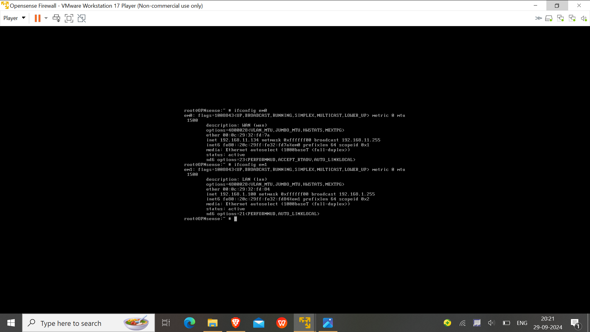
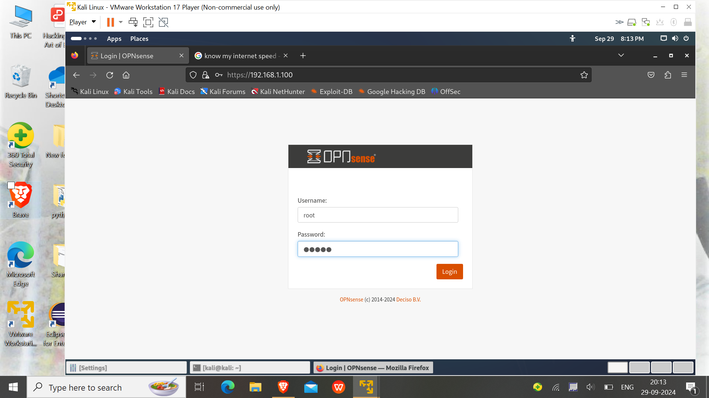
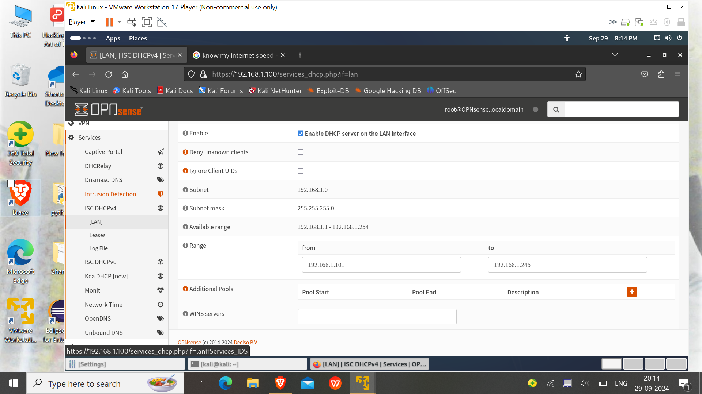

# OPNsense Firewall Setup

## Overview
This section describes the setup of the OPNsense firewall in a VMware environment. OPNsense is used for traffic filtering, network segmentation, act as a router and intrusion detection to secure the internal lab network.

---

## Step 1: Download and Install OPNsense

### 1. Download OPNsense ISO
- Visit the [OPNsense download page](https://opnsense.org/download/) and download the ISO image for your platform.

### 2. Create a Virtual Machine for OPNsense 
- **In VMware**:
  - Click **Create a New Virtual Machine** and chose the disc image(ISO) file.
  - Set Name as Opensense and its location to setup the disk image.
    
  - Allocate at least **1GB of RAM** and **1 CPU core**.
  - Create a virtual hard disk of at least **20GB** with multiple partion.

- **Network Setup**:
  - Add two network adapters:
    1. **Adapter 1 (WAN)**: Set to **vmnet8** to simulate internet connectivity because vmnet is configure for NAT network.
    2. **Adapter 2 (LAN)**: Set to **vmnet3** to connect to your internal VMs.
    

### 3. Install OPNsense
- Start the VM and boot from the OPNsense ISO.
  
- Login as installer with passwd Opnsense
  
- Follow the installation steps:
 
  - Choose **UFS**file system as it compatible to less storage and suitable for our virtual environment.
   
  - Chose the partition the disk.
   
   
  - At Last, set the **root password** for OPNsense.
   
- After installation, the system will reboot, and you’ll see the **console menu** where you can configure the network interfaces.
   

---

## Step 2: Basic OPNsense Configuration

### 1. Assign Network Interfaces and ip addresses to the interfaces
- In the console menu, assign the network interfaces by 1 option:
  - **WAN (em0)**: This will connect to the Internet (vmnet8 interface in vmware).
  - **LAN (em1)**: This will be your internal network interface for connecting to the VMs(vmnet3 interface of vmware).
   
- Now set up and configure the ip address of both interface by choosing **option 2**:
    -Assigned wan ip, default gateway and the dns server by the dhcp of the host vmware.
    -For LAN(em1) assined a static ip(192.168.1.100) and configure a dhcp server that provide ip address to the vms along with providing the range of ip address assigned by the dhcp server.
  
  
  
  
   -At last restart the services on the opnsense by reboot.

### 2. Access the Web Interface
- From any VM on the **Internal Network** (e.g., Kali Linux), open a browser and go to `https://192.168.1.100`.
- Log in with the following credentials:
  - **Username**: `root`
  - **Password**: ********
    
### 3. Initial Setup Wizard
- Follow the OPNsense setup wizard:
  - Set the **Hostname** (set to `opnsense`).
  - Set DNS and Gateway options as default.
    
    
### 4. Update the required packages and download the vmware tools
  -updates the packages and intall the vmware tools as it make running of opnsense smoother in your device.
  
  
---

## Step 3: Configuring Firewall Rules and VLANs

### 1. Create Basic Firewall Rules for LAN
- Navigate to **Firewall > Rules > LAN**.
- Add a rule to allow all outbound traffic from LAN to WAN:
  - **Action**: Pass
  - **Protocol**: Any
  - **Source**: LAN net
  - **Destination**: Any

This rule allows internal VMs to access the internet via the WAN interface.

### 2. Create VLANs (Optional for Advanced Setup)
- If you want to segment your internal network (e.g., separate VMs into different network segments):
  - Go to **Interfaces > Other Types > VLAN**.
  - Create a VLAN and assign it to the LAN interface.
  - Configure firewall rules for each VLAN just like you did for the LAN interface.

### 3. Set Up Intrusion Detection System (IDS) with Suricata
- Navigate to **Services > Intrusion Detection** and enable **Suricata**.
- Download and enable rule sets (e.g., **ET Open** rules) to detect and block malicious activity.
- Start Suricata and monitor network traffic in real-time.

---

## Configuration Files
- [Firewall Rules](config/firewall-rules.xml)
- [Suricata Config](config/suricata-rules.conf)

