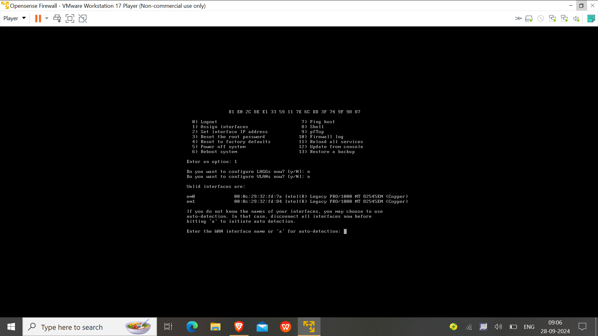
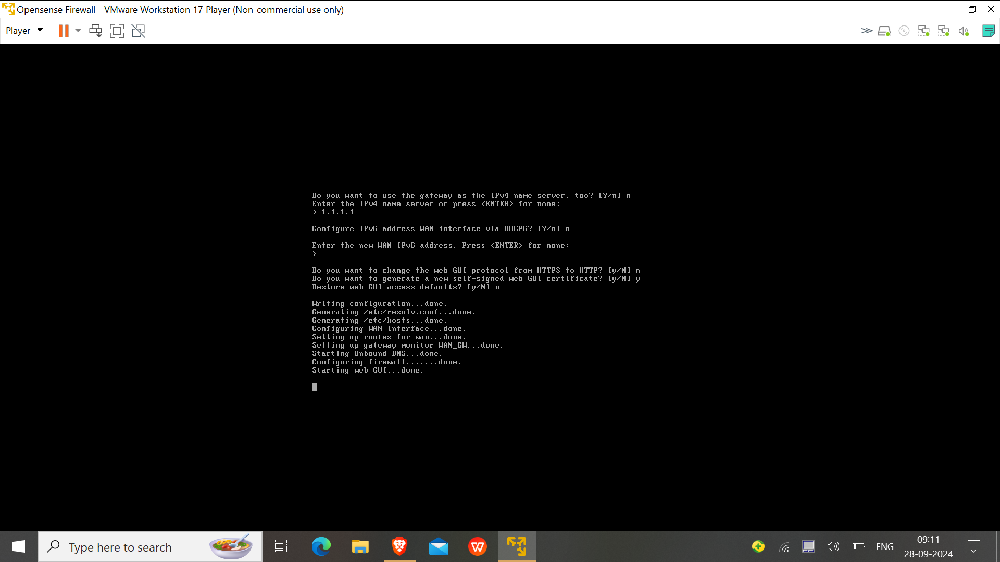
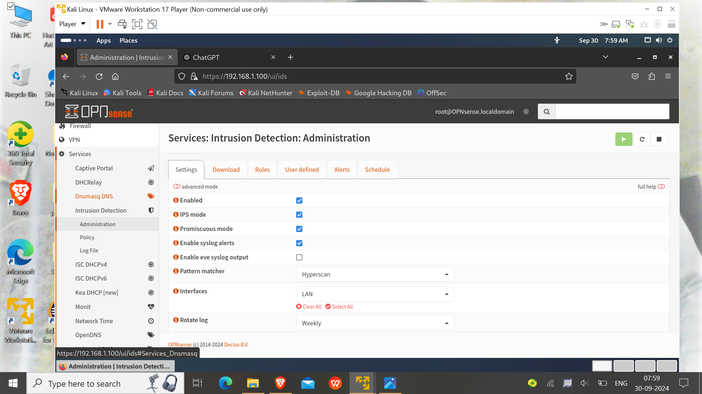
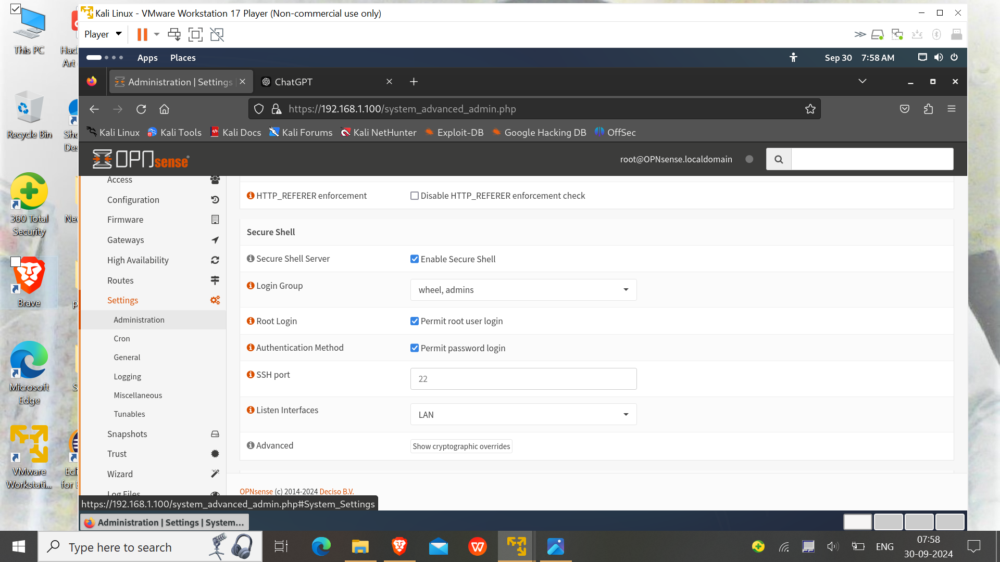
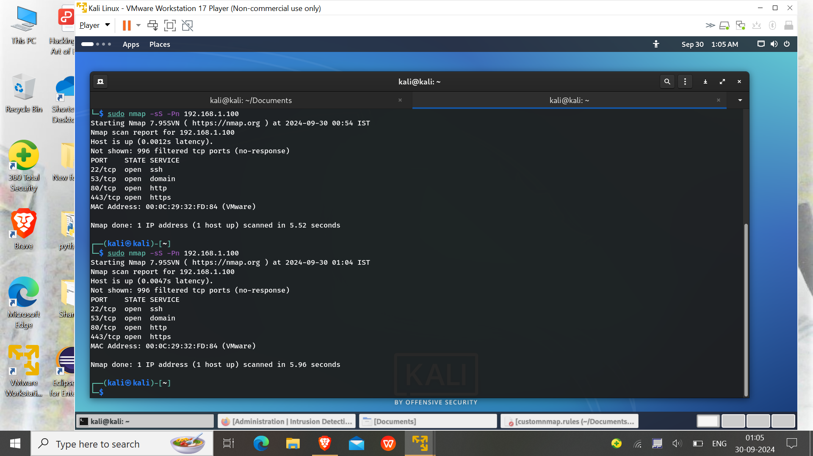
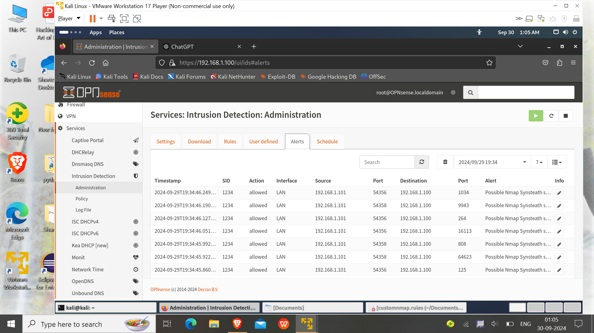

# OPNsense Firewall Setup

## Overview
In this section, I am going to describes the setup of the OPNsense firewall in a VMware environment. OPNsense is used for traffic filtering, network segmentation, act as a router and intrusion detection to secure the internal lab network.

---

## Step 1: Download and Install OPNsense

### 1. Download OPNsense ISO
- Visit the [OPNsense download page](https://opnsense.org/download/) and download the ISO image for your platform.

### 2. Create a Virtual Machine for OPNsense 
- **In VMware**:
  - Click **Create a New Virtual Machine** and chose the disc image(ISO) file.
  - Set Name as Opensense and its location to setup the disk image.
    
  - Allocate at least **1GB of RAM** and **1 CPU core**.
  - Create a virtual hard disk of at least **20GB** with multiple partion.

- **Network Setup**:
  - Add two network adapters:
    1. **Adapter 1 (WAN)**: Set to **vmnet8** to simulate internet connectivity because vmnet is configure for NAT network.
    2. **Adapter 2 (LAN)**: Set to **vmnet3** to connect to your internal VMs.
    

### 3. Install OPNsense
- Start the VM and boot from the OPNsense ISO.
  
- Login as installer with passwd Opnsense
  
- Follow the installation steps:
 
  - Choose **UFS**file system as it compatible to less storage and suitable for our virtual environment.
   
  - Chose the partition the disk.
   
   
  - At Last, set the **root password** for OPNsense.
   
- After installation, the system will reboot, and you’ll see the **console menu** where you can configure the network interfaces.
   

---

## Step 2: Basic OPNsense Configuration

### 1. Assign Network Interfaces and ip addresses to the interfaces
- In the console menu, assign the network interfaces by 1 option:
  - **WAN (em0)**: This will connect to the Internet (vmnet8 interface in vmware).
  - **LAN (em1)**: This will be your internal network interface for connecting to the VMs(vmnet3 interface of vmware).
   
- Now set up and configure the ip address of both interface by choosing **option 2**:
    -Assigned wan ip, default gateway and the dns server by the dhcp of the host vmware.
    -For LAN(em1) assined a static ip(192.168.1.100) and configure a dhcp server that provide ip address to the vms along with providing the range of ip address assigned by the dhcp server.
  
  
  
  
   -At last restart the services on the opnsense by reboot.

### 2. Access the Web Interface
- From any VM on the **Internal Network** (e.g., Kali Linux), open a browser and go to `https://192.168.1.100`.
- Log in with the following credentials:
  - **Username**: `root`
  - **Password**: ********
    
### 3. Initial Setup Wizard
- Follow the OPNsense setup wizard:
  - Set the **Hostname** (set to `opnsense`).
  - Set DNS and Gateway options as default.
    
    
### 4. Update the required packages and download the vmware tools
  -updates the packages and intall the vmware tools as it make running of opnsense smoother in your device.
  
  
---

## Step 3: Configuring Firewall Rules and set up IDS/IPS

### 1. Create Basic Firewall Rules for LAN
- Navigate to **Firewall > Rules > LAN**.
- Add a rule to allow all outbound traffic from LAN to WAN:
  - **Action**: Pass
  - **Protocol**: Any
  - **Source**: LAN net
  - **Destination**: Any
    

This rule allows internal VMs to access the internet via the WAN interface.

### 3. Set Up Intrusion Detection System (IDS) with Suricata
-**Suricata** is a high performance Network IDS, IPS and Network Security Monitoring engine. It is open source and owned by a community-run non-profit foundation, the Open Information Security Foundation (OISF). Suricata is developed by the OISF.As the opnsense IDS and IPS is based on suricata, so lets configure a basic suricata rule that will generate an alert message whenever there is a newwork scanning(using syn request packet) using nmap in the network. 
 
-
- Navigate to **Services > Intrusion Detection > Adminstration** and enable it along with IPS and Promiscuous mode.
 
- Now i had an cusotmnmap.xml script and cusotmnmap.ruless script(both included in the config). The xml script is used(its work) to download the rule file from my local server.
- For this first we have to move the xml file to the opnsense /usr/local/onsense/scripts/suricata/metadata/rules directroy using filezilla because till now we have only the cli of opnsense and with this we can't share the file directly. So to transfer file using filezilla we have to setup a sftp connection between the client vm and opnsense.
- **Enable ssh on opnsense** As default the opnsense disable its ssh services
  
- Establise an ssh connection using username and password authentication via filezilla.
- Now copy paste the file to desired location(i.e /usr/local/opnsense/scripts/suricata/metadata/rules/)
  
- Now serve the customnmap.rule file on your local apache server.
- Go to opnsense and restart the services.
- Navigate to **Intrusion Detection > Adminstration > Download**  and download the custom rule from the list and enable it.
   
- Now apply rules and start monitoring.
- Now start the nmap scan from the any client machine on the network.
  
- Now Navigate to **Intrusion Detection > Adminstration > Alerts** to see the output of suricata rules.
  
---

## Configuration Files
-
- 

