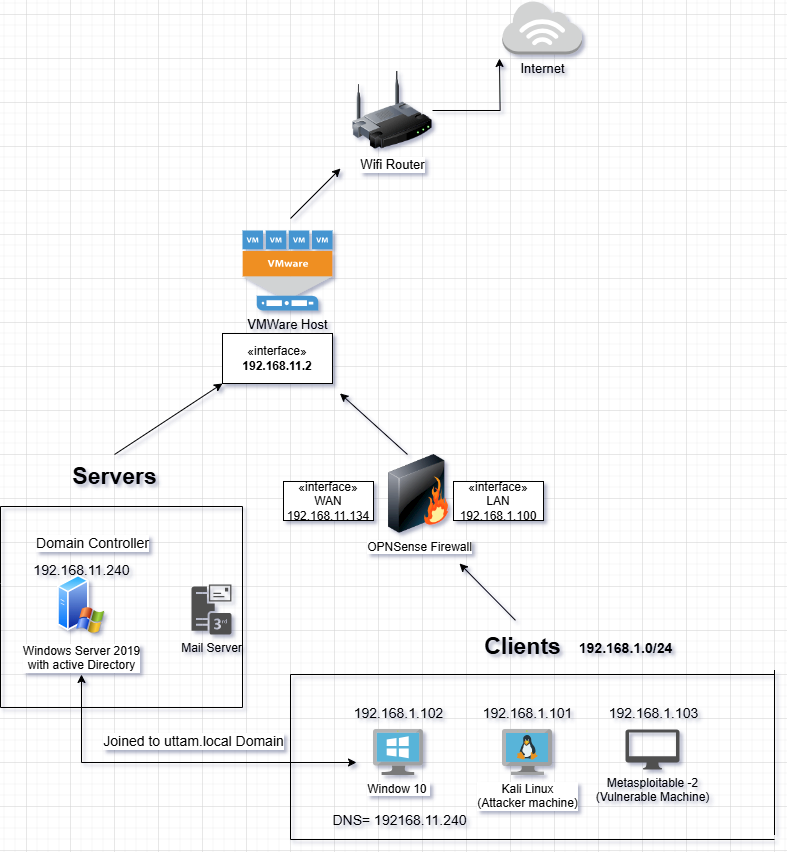

# Cybersecurity-Homelab-and-Penetration-Testing-Project
I designed and implemented a multi-platform cybersecurity homelab to simulate real-world Enterprise environments for practicing penetration testing, Network defense, and Active Directory management. I am building this homelab to stimulate both Offensive and Defensive Security
# Cybersecurity Homelab

## Overview
This project is a hands-on cybersecurity homelab designed to simulate real-world working environments. The lab includes a firewall (OPNsense), a vulnerable (Metasploitable 2) machine for ethical hacking, a Windows Server with Active Directory, a Kali Linux machine for penetration testing, and a Windows client machine for domain joining and interaction. The goal of the lab is to practice penetration testing, vulnerability scanning, network defense, and Active Directory management in a secure and controlled virtual environment.

## Network Topology

The network diagram above illustrates the architecture of the HomeLab environment.
### Virtual Network Configuration

Ensure that your virtualization platform (e.g., VMware Workstation or VirtualBox) is configured with the following virtual networks:

- `VLan3`: Used for connecting pfSense.
- `VLan1`: Used for connecting Kali Linux, windows client machine and the victim machine.
- `VLan2`: Used for connecting windows Server and mail server.

The homelab consists of the following components:
- **Firewall/Router**: OPNsense firewall managing network segmentation and traffic filtering. Also act as a router, VPN and IDS/IPS configuration.
- **Penetration Testing**: Kali Linux machine for ethical hacking and security assessments.
- **Vulnerable Target**: Metasploitable 2 machine with various vulnerabilities for exploitation.
- **Active Directory Environment**: Windows Server 2019 configured with Active Directory for managing users, groups, and policies.
- **Windows Client Machine**: A Windows 10 client machine connected to the AD domain for testing domain user operations and policies.

---

## Components

### 1. **OPNsense Firewall**
- Configured firewall rules to control and filter LAN and WAN traffic.
- Implemented VLANs for network segmentation, separating internal network segments , One for the client machines and one for the servers.
- Installed and configured **Suricata IDS/IPS** for monitoring and blocking malicious network traffic.
- Enabled VPN access for secure remote access to the lab.

### 2. **Kali Linux (Penetration Testing Machine)**
- Kali Linux serves as the main platform for penetration testing and vulnerability assessments.
- Used tools such as **Nmap**, **Metasploit**, **Burp Suite**, and **Wireshark**,**Mfconsole**,**Veil**and lot of vulnerablities scanning and exploitation tools to conduct security testing.
- Launched attacks against the Metasploitable machine and Windows Server to identify vulnerabilities and test defense mechanisms.
- Conducted network reconnaissance, vulnerability scanning, and exploitation tasks.

### 3. **Metasploitable 2 (Vulnerable Target)**
- Metasploitable 2 is used as the vulnerable machine to practice exploitation techniques.
- Vulnerability scanning was performed using **Nmap** and **OpenVAS** to discover services with known vulnerabilities.
- Successfully exploited vulnerabilities such as **FTP**, **SSH**, and **MySQL** using **Metasploit Framework**.
- Documented the exploitation process, results, and mitigations.

### 4. **Windows Server 2019 with Active Directory**
- Deployed Windows Server 2019 with Active Directory Domain Services (AD DS) to simulate an enterprise-level AD environment.
- Created users, groups, and **Group Policy Objects (GPOs)** to enforce security policies and manage network resources.
- Tested Active Directory exploitation techniques such as **Kerberoasting**, **Pass-the-Hash**, and **Lateral Movement** using tools like **BloodHound** and **PowerView**.
- Demonstrated secure password policies, account lockout mechanisms, and multi-factor authentication (MFA).

### 5. **Windows 10 Client Machine**
- Joined the Windows 10 client machine to the Active Directory domain.
- Tested AD user logins, group policies, and security settings from a client perspective.
- Simulated attacks on the client machine to see how GPOs and other security settings could prevent or limit user exploitation.
- Interacted with shared network resources and remote services, testing network policies and permissions.
- Also act as a target Machine to carry out the attacks like malware deployment and browser exploitation and MITM attacks.

---

## Tools and Technologies

- **Firewall/IDS**: OPNsense, Suricata
- **Penetration Testing**: Kali Linux with tools like Metasploit, Nmap, Burp Suite, Wireshark, BeeF and lot more.
- **Vulnerability Scanning**: OpenVAS
- **Active Directory**: Windows Server 2019, BloodHound, PowerView
- **Operating Systems**: Kali Linux, Windows Server, Windows 10, Ubuntu
- **Automation**: Bash scripting, Python, Powershell, Ruby, Perl etc.

---

## Project Structure

- `images/`: Contains screenshots for various configuation and tasks.
- `config/`: Configuration files for OPNsense, Suricata, and other tools.
- `scripts/`: Bash, Python, Perl and Python and other scripts for automation and testing.
- `reports/`: Vulnerability reports, penetration testing documentation.

---

## How to Set Up the Homelab

### Prerequisites
- VirtualBox or VMware Workstation for virtualization ,here I am using VMware workstation.
- ISO files for Windows Server, Kali Linux, Windows 10, and Metasploitable 2
- OPNsense ISO for firewall setup

### Step 1: Set Up OPNsense Firewall
- Download and install OPNsense in VMware workstation.
- Configure WAN and LAN interfaces.
- Set up firewall rules and VLANs for network segmentation and traffic management.

### Step 2: Deploy Metasploitable 2 for Vulnerability Testing
- Install Metasploitable 2 and connect it to the internal network.
- Use Nmap and OpenVAS for vulnerability discovery and testing.

### Step 3: Set Up Windows Server with Active Directory
- Install Windows Server 2019 and configure Active Directory Domain Services (AD DS).
- Create users, groups, and GPOs to enforce security policies.

### Step 4: Set Up Kali Linux for Penetration Testing
- Install Kali Linux and connect it to the internal network.
- Perform network reconnaissance, vulnerability scanning, and exploitation tasks on the Metasploitable and Windows Server machines.

### Step 5: Set Up Windows 10 Client
- Install Windows 10 and join the machine to the Active Directory domain.
- Test domain logins, policies, and user interactions with the network environment.
---

## Sample Reports and Screenshots

- **Vulnerability Report**: [OpenVAS vulnerability scan report](reports/openvas-report.pdf)
- **Penetration Test**: [Metasploit exploitation of Metasploitable 2](reports/metasploit-report.pdf)
- **Active Directory Enumeration**: [BloodHound attack path screenshot](images/bloodhound-attack-path.png)
- **Suricata Alerts**: [Suricata IDS alerts screenshot](images/suricata-alerts.png)

---

## Future Enhancements

- Add more vulnerable machines (e.g., OWASP Juice Shop) to expand penetration testing scope.
- Automate daily vulnerability scans and alerting with Bash and Python scripts.
- Implement advanced red team/blue team exercises using Cobalt Strike for adversary emulation.
- Add a Linux server to simulate an enterprise multi-platform environment.

